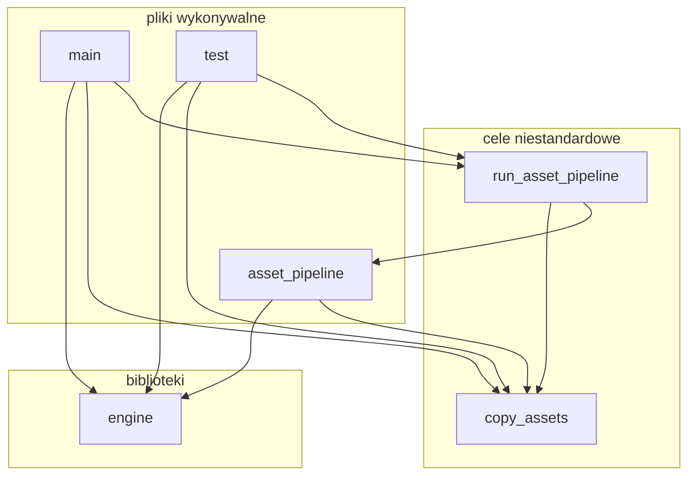
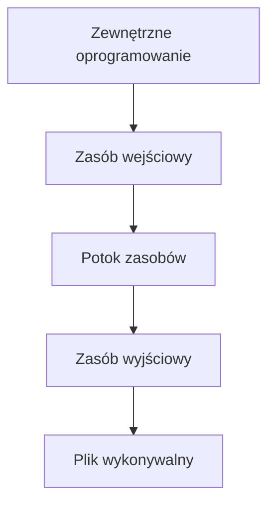

# Praca magisterska - draft

1. Wybierz plik.
2. Definicja / Dlaczego / Co dokładnie robi. ...

HIRO: wrong union in light, remove spot light, rename vertex component to vertex element, rename asset_image to
asset_bitmap, move asset/ outside vulkan/, remove MAX_FRAMEBUFFER_ATTACHMENT_COUNT, remove STORAGE_BUFFER_BIT, move
checking FILTER_LINEAR to image format params

What? Why? How? Nieporuszono: podział przestrzeni i culling, multisampling Zagadnienia: wieloplatformowość, automatyczna
generacja kodu, bazy danych Test: obrazy z HOST_VISIBlE Skróty: GPU, indirect rendering - pośrednie renderowania,
fixed-function, buffor, image, texture - sampled image, binding - dowiązanie, bindless rendering - renderowanie bez
dowiązań, update after bind - uaktualnienie po dowiązaniu tiling - kafelkowanie, texel, staging buffer - bufor
przemieszczenia, MSAA, shader stage - etap cieniowania, shader invocation - wywołanie shadera, draw call - polecenie
rysowania, texture unit - jednostka teksturujące, device feature - funkcja urządzenia, instance feature - funkcja
instancji, sampler - próbnik sampled image - próbkowany obraz, frame - klatka, command buffer - bufor poleceń layout
qualifier - kwalifikator układu update-after-bind - aktualizacja po dowiązaniu variable-sized descriptor binding -
dowiązanie deskryptora o zmiennej wielkości render state - stan renderowania unified uniform buffer - ujednolicony bufor
uniform unified geometry buffer - ujednolicony bufor geometrii GLSL - OpenGL Shading Language swap chain - łańcuch
wymiany WSI - window system integration framebufer attachment - załącznik bufora ramki front buffer - bufor przedni back
buffer - bufor tylni presentation engine - silnik prezentacji in-flight frame - klatka w locie
 
-------------

# Streszczenie

Ninejsza praca opisuje proces zaprojektowania i implementacja silnika renderującego używającego technik cieniowania
odroczonego. Silnik renderujący został zaimplementowany jako biblioteka języka C używająca ekosystemu Vulkan 1.2.
Opisano użyte techniki graficzne używanych podczas renderowania scen w nowoczesnych grach 3D. Opisano architekturę
silnika i szczegóły implementacyjne. Wyrenderowano przykładową scenę i zbadano wydajność silnika.

# 1. Wprowadzenie

...

## Postawowe definicje

Zrozumienie celu pracy wymaga przybliżenia serii fundamentalnych pojęć związanych z grafiką komputerową.

Silnik graficzny ...

...

## Struktura pracy

Praca została podzielona na pięć rozdziałów. Pierwszy rozdział pracy zawiera opis struktury pracy, cel i zakres pracy,
podstawowe definicje oraz przegląd literatury i dostępnych rozwiązań związanych w tematyką silników renderujących. W
drugim rozdziale opisano architekturę silnika i szczegóły implementacji poszczególnych modułów silnika renderującego. W
trzecim rozdziale opisano specyficzny potok graficzny używający cieniowania odroczonego do realizacji modelu oświetlenia
opartego o renderowanie bazujące na fizyce. W czwartym rozdziale wyrenderowano przykładową scenę i zbadano wydajność
silnika. Ostatni rozdział zawiera podsumowanie oraz opis przewidywanych kierunków przyszłego rozwoju silnika.

## Cel i zakres pracy

Celem pracy jest zaprojektowanie i zaimplementowanie silnika graficznego używajągo techniki cieniowania odroczonego.
Silnik został zaimplementowany jako biblioteka programistyczna przy użyciu języków C i Python oraz biblioteki graficznej
Vulkan. Celem autora było zapoznanie się z teorią stojącą za elementami składającymi się na silnik graficzny i
praktyczne zademonstrowanie zdobytej wiedzy.

Praca ma formę przeglądową i jej zakres obejmuje:

- opis algorytmów i technik graficznych używanych w nowoczesnych silnikach graficznych,
- porównanie renderowania odroczonego z tradycyjnym renderowaniem wprzód,
- omówienie architektury i implementacji projektu,
- demonstrację użycia silnika graficznego do wyrenderowania przykładowej sceny,
- analizę wydajności silnika graficznego.

Omówiono obecny stan wiedzy dotyczący algorytmów, struktur i technik renderowania. Szczególną uwagę przyłożono do
technik cienowania odroczonego.

Silnik graficzny składa się z [założenia kierujące projektem i implementacją]

...

## Przegląd

# 2. Podstawy teoretyczne

...

# 3. Implementacja

Ten rozdział przedstawia szczegóły implementacji poszczególnych elementów silnika.

## Założenia

Implementacji przyświacały następujące:
Niskopoziomowość. ...

## Struktura plików

Wszystkie pliki silnika znajduje się w jednym katalogu głównym.

Katalog główny jest podzielony na mniejsze podkatalogi:

- *assets*: zawierający pliki wejściowe potoku zasobów,
- *src*: kod źródłowy silnika dla języka C,
- *scripts*: kod źródłowy silnika dla języka Python,
- *thirdparty*: kod źródłowy bibliotek zewnętrznych.

Proces budowania stwarza dodatkowe podkatalogi tymczasowe:

- *venv*: środowisko wirtualne interpretera języka Python,
- *cmake-build-debug* & *cmake-build-release*: katalogi budowania

## Użyte narzędzia

Silnik została napisany jako biblioteka w języku C w standardzie C11. Budowanie biblioteki ze źródeł wymaga generacji
dodatkowego kodu przy pomocy skryptów w języku Python w wersji 3.9.7.

Silnik został opracowany na maszynie z systemem Linux i wspiera systemy Linux i Windows. Projekt został w całości
napisany przy użyciu środowiska programistycznego *CLion 2021.2.3*.

Podczas pracy stosowano rozproszony system kontroli wersji *git*. Repozytorium jest utrzymywane na serwisie *GitHub*.

Pliki *.clang-tidy* i *.clang-format* znajdujące się w strukturze plików projektu pozwalają na automatyczne formatowanie
kodu źródłowego zgodnie ze uprzednio zdefiniowanym standardem kodowania.

Proces budowania projektu jest zautomatyzowany przy użyciu narzędzia CMake, które w przypadku języków C i C++ jest
praktycznie standardem podczas rozwoju wieloplatformowych projektów.

### Proces budowania

Proces budowania silnika jest zdefiniowany w pliku *CMakeLists.txt* znajdującym się w katalogu głównym projektu.

Kompilacja kodu źródłowego w języku C jest obsługiwana bezpośrednio przez CMake, które generuje standardowe pliki
kompilacji (pliki Makefile w systemie Unix, projekty Microsoft Visual C++ w systemie Windows). Użyto prekompilowanych
nagłówków do przyśpieszenia kompilacji bibliotek zewnętrznych.

Skrypty w języku Python są obsługiwane pośrednio przez CMake, które wykrywa zainstalowany interpreter języka Python i
używa go do stworzenia tzw. środowiska wirtualnego w tymczasowym katalogu venv/ w głównym katalogu projektu. Podczas
procesu budowania środowisko wirtualne jest używane do zainstalowania wymaganych zewnętrznych bibliotek w języku Python
i wykonywania skryptów generatora kodu. Zaletą użycia środowiska wirtualnego w porównaniu do bezpośredniego wywoływania
zainstalowanego interpretera Pythona jest izolacja zarządzania zależnościami od reszty systemu operacyjnego, co pozwala
na łatwiejszą powtarzalność podczas debugowania. [PEP]

CMake organizuje proces budowania jako graf, w którym wierzchołki to cele połączonych ze sobą zależnościami. Budowa celu
wymaga wcześniejszego zbudowania wszystkich innych celów od których zależy budowany cel.

Wyróżniane są trzy rodzaje celów:

- plik wykonywalny
- biblioteka
- cel niestandardowy

Poniższy diagram przedstawia proces budowania projektu w formie celów i ich zależności:



**engine** Cel odpowiedzialny za zbudowanie biblioteki programistycznej z implementacją silnika.

**main** Cel odpowiedzialny za zbudowanie pliku wykonywalnego o nazwie *main* demonstrującego użycie silnika poprzez
wyrenderowanie przykładową scenę.

**test** Cel odpowiedzialny za zbudowanie pliku wykonywalnego o nazwie *test*  wykonującego testy integracyjne.

**asset_pipeline** Cel odpowiedzialny za zbudowanie pliku wykonywalnego o nazwie *asset_pipeline* będącego narzędziem
wiersza poleceń implementującym operacje potoku zasobów.

**copy_assets** Niestandardowy cel odpowiedzialny za skopiowanie podkatalogu *assets* do katalogu budowania.

**run_asset_pipeline** Niestandardowy cel odpowiedzialny uruchomienie skryptu Python realizującego potok zasobów poprzez
wielokrotne użycie wcześniej zbudowanego narzędzia *asset_pipeline*.

...

### Biblioteki zewnętrzne

Silnik następujących zewnętrznych bibliotek programistycznych:

- *Vulkan SDK 1.3.211.0*: pliki nagłówkowe dla Vulkan, kompilacja shaderów z kodu źródłowego GLSL do kodu bajtowego
  SPIR-V poprzez *shaderc*, mechanizm refleksji dla kodu bajtowego SPIR-V poprzez SPIRV-Reflect,
- *glfw 3.4*: międzyplatformowa obsługa tworzenia okien, obsługa wejścia klawiatury i myszy,
- *sqlite 3.35.5*: relacyjna baza danych SQL,
- *uthash 2.3.0*: proste struktury danych (tablica dynamiczna, lista dwukierunkowa, tablica mieszająca),
- *xxHash 0.8.1*: niekryptograficzny algorytm mieszający,
- *cgltf 1.11*: wczytywanie plików w formacie glTF,
- *cglm 0.8.5*: biblioteka matematyczna,
- biblioteka standardowa C,
- API systemu: pliki nagłówkowe POSIX albo WinAPI,
- biblioteka standardowa Python,
- *libclang 12.0.0*: analizowanie kodu C w Python,

Dodatkowo biblioteka zbudowana w konfiguracji *Debug* statycznie linkuje biblioteki ASan (AddressSanitizer) i UBSan (
UndefinedBehaviorSanitizer) wykrywające szeroką klasę błędów dotyczących niewłaściwego użycia pamięci i
niezdefiniowanych zachowań. Błędy te w języku C są nieoczywiste i trudne do wykrycia przez programistę. Podczas rozwoju
projektu ASan wielokrotnie pozwolił na wykrycie i naprawienie następujących rodzajów błędów:

- wycieki pamięci,
- dereferencje zwisających wskaźników,
- dereferencja wskaźników NULL,
- dereferencja źle wyrównanych wskaźników,
- odczyt i zapis poza granicami tablicy.

## Architektura

Silnik składa się z siedmiu modułów. Moduły:

- generator kodu:  ...
- rdzeń: funkcje pomocnicze: ...
- zasoby: wczytywanie i zapisywanie danych sceny i konfiguracji globalnej
- scena: konstrukcja grafu sceny, drzewa sceny i listy renderującej
- potok graficzny: abstrakcja podstawowych operacji renderowane używających Vulkan
- przebieg renderowania: ...
- graf renderowania: ...

Każdemu modułowi zostanie poświęcony osobny podrozdział.

## Generator kodu

...

## Rdzeń

...

## Dane

[???]
...

## Zasoby

Moduł zasobów jest odpowiedzialny za zapisywanie i wczytywania sceny z bazy zasobów. ...

### Definicje

W kontekście silnika zasób (ang. *asset*) można zdefiniować jako ogół jego elementów, które nie są częścią jego kodu
źródłowego i mogą być niezależnie od niego dodawane, usuwane i modyfikowane.

Zasoby można podzielić na zasoby wejściowe (surowe) i wyjściowe (przetworzone).

Zasoby wejściowe mają formę plików w formacie przystosowanym do edycji przy użyciu zewnętrznego oprogramowania.
Przykładem zasobu wejściowego jest model 3D stworzony w programie do grafiki 3D Blender [BLENDER].

[OBRAZEK: MODEL 3D]

Zasoby wyjściowe mają formę plików w formacie przystosowanym do manipulacji przez silnik. Przykładami zasobów
wyjściowych są pliki z rozszerzeniami *.uasset* i *.umap* używane przez silnik Unreal Engine do przechowywania zasobów w
zoptymalizowanym formacie binarnym.

Potok zasobów (ang. *asset pipeline*) to część silnika odpowiadająca za konwersję zasobów wejściowych na zasoby
wyjściowe. Konwersja ta jest spowodowana wyżej opisanymi różnymi wymaganiami dotyczącymi ich formatów.

Poniższy diagram przedstawia przepływ pracy zasobów:



Baza zasobów (ang. *asset database*) to zasób wyjściowy mający na celu zgromadzenie informacji o wszystkich zasobach
używanych przez silnik. ...

### Implementacja

Rodzaje zasobów wejściowych wyróżniownych na potrzeby projektu:

- ...

Rodzaje zasobów wyjściowych wyróżniownych na potrzeby projektu:

- ...

Na potrzeby projektu wyróżniono następujące rodzaje zasobów:

- konfiguracja globalna,
- shadery,
- kamera,
- światło
- ...

Wymienione powyżej rodzaje zasobów są opisane w następnych podrozdziałach.

*Konfiguracja globalna* Plik ... ...

## Scena

Moduł sceny jest odpowiedzialny za wygenerowanie ze sceny listy obiektów renderowania. Struktury:
Scene data... Scene graph... Scene tree... Render cache... Render cache list...

...

## Potok graficzny

Moduł potoku graficznego udostępnia zbiór obiektów pozwalających na użycie bilioteki graficznej Vulkan za pośrednictwem
wygodniejszej dla programisty abstrakcji. ...

## Przebieg renderowania

Moduł przebiegu renderowania jest odpowiedzialny za wyrenderowanie całości bądź części listy renderującej. Przebieg
renderowania nagrywa polecenia do podanego bufora poleceń.
[DIAGRAM]

...

## Graf renderowania

Moduł grafu renderowania jest odpowiedzialny za stworzenie przebiegów renderowania na podstawie wysokopoziomowego
deklaratywne opisu renderowania dostarczonego przez programistę. ...

# 4. Badania

...

# 5. Podsumowanie

...

# Bibliografia

...
[PEP] https://peps.python.org/pep-0405/
[BLENDER] https://www.blender.org/
[GLTF] https://www.khronos.org/registry/glTF/specs/2.0/glTF-2.0.html
[GLTF_LIGHT] https://github.com/KhronosGroup/glTF/blob/main/extensions/2.0/Khronos/KHR_lights_punctual/README.md
[SRAA] Subpixel Reconstruction Antialiasing for Deferred Shading

# TODO

/vulkan/debug.h Obiekt vulkan_debug pozwala na dodawanie informacji debugujących do obiektów Vulkan. Jest to osiągnętę
przy pomocy rozszerzenia VK_EXT_debug_utils. Rozszerzenie VK_EXT_debug_utils pozwala na stworzenie komunikatora
debugowania (ang. debug messanger) przechwytującego wszystkie komunikaty debugowania wygenerowane przez moduł ładowania,
warstwy i sterownik Vulkan. Przechwycone komunikaty debugowania są przekazywne do wywołania zwrotnego, które loguje
wiadomość z odpowiednim priotytetem. Użycie debuggera wspierającego warunkowe punkty przerwania (ang. conditional
breakpoint) dla wiadomości o priorytecie error lub fatal pozwala na zatrzymanie działania programu tuż po zgłoszeniu
błędu przez warstwy walidacji, co upraszcza proces debugownia.
[OBRAZEK]

Rozszerzenie VK_EXT_debug_utils pozwala na dodawanie nazw do obiektów Vulkan oraz etykiet do regionów kolejek i buforów
poleceń. Nazwy i etykiety są używane w wiadomościach debugujących i pokazywane przez zewnętrzne narzędzia do debugowania
grafiki, co upraszcza proces debugowania.
[OBRAZER RENDERDOC]

-------------
/vulkan/constants.h Lista stałych wartości uznanych za zbyt niepraktyczne aby pozwolić na ich modyfikację przy użyciu
konfiguracji globalnej:

Stała FRAMES_IN_FLIGHT określa liczbę ramek, do których mogą być jednocześnie renderowane przez GPU. Domyślna wartość to
2, co pozwala na podwójne buforowanie. Stała MAX_OFFSCREEN_TEXTURE_COUNT określa maksymalną liczbę obrazów
pozaekranowych. Domyślna wartość to 16. Stała MAX_RENDER_TARGET_COUNT określa maksymalną liczbę celów renderowania,
które mogą być używane podczas jednego przebiegu renderowania. Domyślnie 8. Stała MAX_INDIRECT_DRAW_COMMAND_COUNT.
Domyślnie 1024. Stała MAX_MATERIAL_COUNT Domyślnie 128. Stała MAX_DIRECTIONAL_LIGHT_COUNT określa maksymalną liczbę
świateł kierunkowych. Domyślnie 1. Stała MAX_POINT_LIGHT_COUNT określa maksymalną liczbę świateł punktowych. Domyślnie
128 Stała MAX_TEXT_CHARACTER_COUNT określa maksymalną liczbę znaków w renderowanym ciągu znaków. Domyślnie 256. Stała
MIN_DELTA_TIME określa minimalny czas pomiędzy wywołanami funkcji update podanej przez użytkownika. Domyślnie (1.0 /
60.0) (60 ramek na sekundę). Stała WORLD_UP określa wektor interpretowany jako "w górę" w przestrzeni świata. Domyślna
wartość to (0, 1, 0). Stałe mogą być używane przez shadery - ich definicje preprocesora są umieszczane na początku kodu
źródłowego w języku GLSL przed kompilacją.
-------------
/vulkan/common.h Globalna tablica typów obrazów wspieranych przez silnik:
[TABELA]
Struktura aabb reprezentuje prostokąt ograniczający (ang. axis-aligned bounding box, AABB). Pozwala na obliczenie
najmniejszej i największej pozycji renderowanych wierzchołków sceny, co pozwala na obliczenie domyślnej pozycji kamery w
taki sposób, żeby obejmowała ona całą scenę. Funkcja get_perspective_matrix oblicza macierz rzutu perspektywicznego z
przestrzeni widoku do przestrzeni przycinania (ang. clip space).
[OBRAZEK]

Funkcja get_orthographic_matrix oblicza macierz rzutu prostokątnego z przestrzeni widoku do przestrzeni przycinania (
ang. clip space). Przestrzeń przycinania w Vulkanie jest prawoskrętna z flipped Y.
-------------
/src/assets Zawiera obiekty zasobów. Obiekt zasobów reprezentuje zasoby znajdujący się w bazie zasobów. Obiekty zasobów
są obiektami POD (ang. Plain Old Object), ich jedynym zadaniem jest udostępnienie informacji o zasobach elementom
silnika na wyższym poziomie.
[DIAGRAM]
Struktura obiektów zasobów jest inspirowana strukturą zasobów w formacie glTF pokazaną na poniższym diagramie:
[DIAGRAM https://www.khronos.org/registry/glTF/specs/2.0/glTF-2.0.html#concepts-general]
W formacie glTF scena składa się z węzłów, które są obiektami przeznaczonymi do wyrenderowania. Węzeł zawierać lokalną
transformację przestrzeni oraz referencję od renderowanych zasobów.
------
/src/assets/common.h Definiuje interfejs współdzielony przez obiekty zasobów. Współdzielone pola:

- klucz zasobu: otrzymany w wyniku użycia funkcji haszującej na polach obiektu jednoznacznie identyfikujących obiekt
  jako unikalny zasób, rodzaj optymalizacji
- wskaźnik do sceneData: każdy zasób zawiera wskaźnik do obiektu sceny któym jest zarządzany,
- wskaźniki prev i next (intrusive doublylinked list). Współdzielone funkcje:
- init: inicjalizacja
- deinit: deinicjalizacja
- calculate_key: oblicza klucz zasobu, wymagane ponowne obliczenie po każdej modyfikacji obiektu,
- serialize: serializacja, zapis pól obiektu do bazy zasobów
- deserialize: deserializacja, odczyt pól obiektu z bazy zasobów, używa klucza
- debug_print: funkcja pomocnicza używana podczas debugowania, loguje pola obieku

------
/src/assets/camera.h Zasób reprezentujący parametry kamery. Dostępne są dwa rodzaje kamery:

- ortograficzna,
- perspektywiczna. Kamera perspektywiczna posiada parametry:
- fovY: vertical field of view (radians)
- aspectRatio:
  Kamera or
- magX: Horizontal magnifiaction of view
- magY: vertical magnification of view
- nearZ:
- farZ:
  Pola nearZ i farZ definiują kolejno odległości bliskiej i dalekiej przestrzeni przycinania. Ostateczna pozycja i
  rotacja kamery jest wyliczana na podstawie wynikowej transformacji przestrzeni obiektu, który posiada parametry
  kamery.

------
/src/assets/light.h Zasób światła. Reprezentuje światło punktowe na scenie. Struktura zasobu jest inspirowana
rozszerzeniem KHR_lights_punctual formatu glTF 2.0. Dostępne są dwa rodzajów światła punktowego:

- światło kierunkowe (ang. directional light)
- światło punktowe (ang. point light)
  [DIAGRAM]
  Wszystkie rodzaje świateł posiadają parametry:
- intensywność,
- kolor. Światło kierunkowe definiuje dodatkowy parametr kierunek w przestrzeni świata. Światło punktowe i reflektorowe
  definiuje dodatkowy parametry:
- pozycja: punkt w przestrzeni świata.
- zakres: promień sfery zdefiniowanej w pozycji światła. poza którą intensywność światła osiąga zero.

------
/src/assets/material.h Zasób materiału. Reprezentuje parametry materiału używanego podczas renderowania powierzchni
prymitywów.

Materiał jest zdefiniowany przy użyciu metallic-roughness material model posiada następujące właściwości:

- kolor podstawowy (ang. base color): informacja o kolorze obiektu
- metaliczności (ang. metalness): określa metaliczność materiału, tj. czy materiał jest metalem czy dielektrykiem
- chropowatość (ang. roughness): określa chropowatość materiału, tj. czy materiał jest błyszczący czy matowy

Materiał definiuje kolor podstawowy (ang. base color) przy użyciu parametrów:

- współczynnik koloru podstawowego: vec4
- tekstura koloru podstawowego: komponent RGB

Materiał definiuje metaliczność i chropowatość przy użyciu parametrów:

- współczynnik metaliczności: liczba zmiennoprzecinkowa w zakresie <0:1>, czy materiał jest metalem czy dielektrykiem
- współczynnik chropowatości: liczba zmiennoprzecinkowa w zakresie <0:1>, określa czy materiał jest błyszczący czy
  matowy
- tekstura metaliczności-chropowatości: opcjonalne, wartość metalicznści są w kanale B tekstury. wartość metalicznści są
  w kanale G tekstury

Materiał może dodatkowo definiować mapę normalnych (ang. normal map) jest używana do techniki mapowania normalnych.

------
/src/assets/mesh.h Zasób siatki. Reprezentuje grupę prymitywów graficznych. Siatka jest uzyskiwana z modelu
przygotowanego w programie do modelowania 3D. Siatka jest tożsama z geometrią obiektu na scenie. Podział na siatkę i
prymitywy ma na celu zmniejszenie redundancji - przykładowo siatka modelu auta może zawiarać 4 prymitywy koła.
[OBRAZEK]
/src/assets/vertex_attribute.h Zasób atrybutu wierzchołka. Wierzchołek składa się z kilku różnych atrybutów wierzchola,
np. pozycji, normalnej, i koloru. Ten zasób reprezentuje dane atrybutu wierzchołka w postaci tablicy elementów.
Wyróżniowo cztery rodzaje elementów:

- uint32_t:
- vec2,
- vec3,
- vec4.

------
/src/assets/primitive.h Zasób primitywu graficznego. Reprezentuje część siatku obiektu. Primityw składa się z dwóch
elementów: geometrii oraz materiału. Jeden prymityw zawiera wszystkie dane wymagane do wygenerowania jednego polecenia
rysowania. Geometria prymitywu składa się z:

- rodzaju topologii,
- indeksów wierzchołków,
- atrybutów wierzchołków. Topologia definiuje sposób renderowania wierzchołków.
  [DIAGRAM]
  Na potrzeby silnika wyróżniono pięć rodzajów atrybutów wierzchołków:
- pozycja: vec3
- normalna: vec3
- kolor: vec3
- koordynat tekstury: vec2
- styczna: vec4 Wierzchołek jest sumą atrybutów wierzchołków.
  [DIAGRAM]
  Indeksy wierzchołków pozwalają na kompresję bufora wierzchołków poprzez wprowadzenie bufora indeksów.
  [DIAGRAM]

------
/src/assets/object.h Zasób obiektu. Reprezentuje jeden element sceny. Zawiera referencje do:

- zasobu siatki,
- zasobu kamery,
- zasobów obiektu, Zawiera macierz 4x4 z lokalną transformacją przestrzeni. /src/assets/texture.h Zasób bitmapy.
  Reprezentuje obraz w postaci nieskompresowaną bitmapy. Bitmapa to prostokątna tablica pikseli. Rozmiar bitmapy jest
  specyfikowany przy użyciu szerokości, wysokości, głębokości oraz liczby ścian (domyślnie 1 ściana, 6 ścian dla
  tekstury sześciennych). Rozmiar piksela jest specyfikowany przy użyciu liczby kanałów - jeden kanał jest
  reprezentowany przez jeden bajt (8-bitowe kanały). Obecnie silnik nie wspiera ładowania tekstur zmiennoprzecinkowych (
  np. mapy sześcienne HDR), więc założenie 8-bitów per kanał jest wystarczające. Zasób samplera. Reprezentuje parametry
  samplera używany podczas próbkowania obrazu. VkFilter magFliter i minFilter. VkSamplerAddressMode addressModeU,
  addressModeV.

Zasób tekstury składa się z zasobu bitmapy i zasobu samplera. Wydzielono osobne zasoby dla zasobu skybox i zasobu
czcionki. Zasob skybox nazwę skyboxa i zasób tekstury. Zasób czcionki posiada nazwę czcionki, zasób tekstury, ciąg
znaków z alfabetem czcionki i rozmiar jednego glifu w pikselach.
-------------
/src/data Obiekty pozwalające na parsownie plików konfiguracyjnych i baz danych. Pierwszy moduł używający wygenerowanego
kodu.

------
/src/data/config.h Parsowanie konfiguracji w formacie INI.
------
/src/data/db.h Definiuje obiekt bazę danych SQLite. SQLite posiada "dynamiczny" system typowania (ang. dynamic type
system), który pozwala na słabe typowanie przy użyciu następujących typów proste: INT, TEXT, BLOB Biblioteka dodaje
dodatkowe typy złożone: VEC3,... oraz ich wersje tablicowe: VEC3_ARRAY, ... - baza danych SQLite wciąż używa typów
prostych, ale następuje serializacja i deserializacja typów złożonych.
[LISTING]
Biblioteka pozwala na przeprowadzanie standardowych operacji wyboru (ang. select) i wprowadzania (ang. insert).
[LISTING]
------
/src/data/asset_db.h Definiuje obiekt bazę zasobów. Używa on wewnętrznie obiekt bazy danych SQLite i dodaje operacje
wyboru i wprowadzania dla poszczególnych tabel i kolumn bazy zasobów:
[LISTING]

-------------
/src/codegen Kod źródłowy języka C generowany automatycznie przy użyciu skryptów w języku Python. Język C nie posiada
mechanizmów pozwalających na metaprogramowanie z wyjątkiem makr preprocessora, który może zaspokoić część potrzeb
programisty chcącego przykładowo rozszerzyć dostępne rodzaje pętli, ale nie pozwala na bardziej skomplikowane analizę i
przekształcenia kodu, co przekonało autora do dodania automatycznej generacji kodu do projektu. Generacja kodu jest
wykonywana przez skrypt codegen.py. Skrypt parsuje pliki nagłówkowe języka C znajdujący się w katalogu /src z
pominięciem katalogu /src/codegen, do którego skrypt zapisuje wygenerowane pliki nagłówkowe i pliki źródłowe.
Wygenerowane pliki nagłówkowe są dołączane w innych modułach silnika . Wygenerowane pliki źródłowe są argumentami
kompilatora. Skrypt jest uruchamiany przez CMake na początku procesu budowania przed rozpoczęciem kompilacji właściwego
kodu źródłowego biblioteki napisanego w języku C. Działanie skryptu jest parametryzowane przy użyciu pliku konfiguracji
generatora kodu znajdującej się w /scripts/config.txt. Ma ona format INI. Format INI jest podzielony na sekcje, które
zawierają pary klucz-wartość:
[PRZYKŁAD]
/src/codegen/descriptors.h Definicje struktur helper_element i funkcji glsl_add wygenerowanych na podstawie analizy
struktur helper_struct pliku nagłówkowego /src/objects/descriptor.h.

Stuktury helper_struct opisują wewnętrzną strukturę buforów uniform znajdujących się na GPU. Relacja ta została
przedstawiona na poniższym diagramie:
[helper_struct w C -> helper_element na GPU & kod GLSL]
Układ pamięci struktur zdefiniowanych w języku C nie są koniecznie kompatybilne układem pamięci wymaganymi przez GPU.
Fakt ten wymusza generacje struktur helper_element, w których użyto atrybutów alignas udostępnianych przez C11 do
wyrównania pól struktury w układzie pamięci *scalar*.

Układ pamięci definiuje wielkości i wyrównania pól w strukturze w pamięci. Układy pamięci wspierane przez GPU są
specyfikowane w shaderach przy użyciu jednego z następujących coraz nowszych standardów:

- std140,
- std430,
- scalar.

Każdy kolejny standard pozwala na ciaśniejsze upakowanie pól w buforze, co skutkuje mniejszym zużyciem pamięci GPU.

Funkcje glsl_add zwracają ciągi znaków z definicjami struktur buforów uniform w języku GLSL i są używane podczas
generacji shaderów, co zostanie opisane później w pracy podczas opisu potoku renderowania.

Dodanie nowej struktury buffora uniform sprowadza się do zdefniniowania nowej struktury w /src/objects/descriptor.h, co
pozwala na szybkie dodawania nowych parametrów podczas pisania shaderów.

------
/src/codegen/globals.h Globalny obiekt globals wygenerowane na podstawie konfiguracji generatora kodu. Obiekt zawiera
ścieżki do plików z konfiguracją globalną i bazą zasobów.
------
/src/codegen/macros.h Makra preprocesora wygenerowane na podstawie konfiguracji generatora kodu. Struktura
wygenerowanych makr pozwala na użycie ich w ramach techniki X-macro.
[PRZYKŁAD LISTING]
Wygenerowane makra są używane do implementacji:

- konfiguracji globalnej,
- konfiguracji zasobów,
- bazy zasobów. Makra opisują strukturę konfiguracji globalnej i zasobów:
- sekcje
- pary klucz-wartość i ich domyślne wartości. Makra opisują strukturę bazy zasobów:
- typy podstawowe bazy danych i ich odpowiedniki w języku C [PRZYKŁAD]
- tabele w bazie danych

------
/src/codegen/meta.h Funkcje pozwalające na konwersję wartości typu wyliczeniowego na ciąg znaków.
[PRZYKŁAD LISTING]
Na jeden typ wyliczeniowy przypada jedna funkcja. Te funkcje to przykład koncepcji w metaprogramowaniu zwanego
refleksją. Funkcje są użyteczne podczas debugowania - podczas działania programu typy wyliczeniowe języa C są zwykłymi
liczbami, człowiek lepiej orientuje się widząc ich nazwy.

-------------
/src/core/thirdparty.h Nagłówek thirdparty.h dołączający nagłówki bibliotek zewnętrznych. Nagłówek prekompilowany (ang.
precompiled header, PCH) z powodów wydajnościowych. Część bibliotek zewnętrznych ma formę jedynie nagłówków (ang.
header-only library). W tradycyjnych bibliotekach języka C kod jest podzielony na pliki nagłówkowe i pliki źródłowe.
Pliki nagłówowe zawierają deklaracje (funkcji, struktur, typów wyliczeniowych itp.) widocznych dla użytkownika końcowego
i powinny być dołączone do programu przy użyciu dyrektywy #include preprocesora. Pliki źródłowe zawierają definicje
deklaracji plika nagłówkowego i powinny być dołączone do programu używając argumentów kompilatora (jeśli dodawane są
niezbudowane pliki źródłowe) bądź linkera (jeśli dodawane są zbudowane pliki biblioteczne). W przypadku jedynie
nagłówków dostęp do definicj tradycyje znajdujących sę z plikach źródłowych jest uzyskiwany poprzez ponowne dołączenie
pliku nagłówkowego przy użyciu dyrektywy #include przy wcześniejszym zdefiniowaniu symbolu preprocesora. Nagłówek
thirdparty.h posiada odpowiadający mu plik źródłowy thirdparty.c robiący to.
------
/src/core/platform.h Wieloplatformowe funkcje. Funkcja panic(). Używa atrybutu noreturn i pozwala na zamknięcie programu
po wystąpieniu fatalnego błędu. Odkrywanie ścieźki z katalogiem zawierającym plik wykonywalny - potrzebne do znalezienia
plików z konfiguracją i zasobami. Na systemie Linux używana jest funkcja readlink() do odczytania pliku /proc/self/exe
oraz funkcja dirname(). Na systemie Windows używana jest funkcja GetModuleFileName() oraz funkcja PathRemoveFileSpec().
Obsługa plików - zapisywanie i wczytywanie. Inicjalizacja systemu logowania.

------
/src/core/log.h System logowania wiadomości. Logowanie znacząco upraszcza proces debuggowania. Logowanie odbywa się
poprzez funkcje zachowujące się tak samo jak funkcja printf - pierwszy argument to ciąg znaków z znakami formatującymi,
reszta argumentów to formatowane wartości. Rozróżniane jest pięć priorytetów wiadomości:

- debug,
- info,
- warn,
- error,
- fatal. Wiadomości są zapisywane do standardowego wyjścia (stdou albo stderr) oraz do pliku na dysku.

------
/src/core/junk.h Proste funkcje i makra które mogą być potencjalnie używane na wskroś wszystkich modułów w całej
bibliotece. Symbole preprocessora definiowane warunkowo z zależności od systemu operacyjnego dla którego biblioteka jest
kompilowana (Linux, MacOS, Windows). Przetwarzanie ciągów znaków. Liczenie bitów w flagach. Używanie funkcji skrótów.
Makra upraszczające użycie preprocesora języka C. Makra upraszczające opreracje na kontenerach. Zebranie wszystkich
drobnych funkcji pomocniczch w jedno miejsce projektu upraszcza proces implementacji.
------
/src/core/alloc.h

Funkcje pomocnicze wspomagające zarządzanie pamięcią:

- alokacja i deaokacja bloków pamięci na stercie,
- duplikacja bloków pamięci,
- porównywanie bloków pamięci.

Potrzebne, ponieważ działanie odpowiednich funkcji oferowane przez bibliotekę standardową języka C, chociaż oferują
żądaną funkcjonalność, opiera się na mechanizmie niezdefiniowanych zachowań (ang. undefined behaviour) dla niektórych
argumentów (wskaźnik NULL, rozmiar 0) i zachowań OOM (ang. Out-of-memory).

Funkcje pomocnicze są wrapperami na funccje biblioteki standardowej języka C z dodatkowymi instrukcjami warunkowymi
sprawdzającymi, czy wywołanie funkcji nie skutkuje niezdefiniowanym zachowaniem.

-------------
Vulkan wyróżnia dwa rodzaje zasobów: bufory i obrazy.

Bufor to ciągły blok pamięci który może być odczytany i zapisywany przez GPU. Bufor jest najprostszym i najbardzoei
podstawowym zasobem oferowanym przez Vulkan.

Obraz podobnie jak bufor reprezentuje ciągły blok pamięci, ale jego struktura jest bardziej skomplikowana i
interpretowana według od parametrów określonych podczas tworzenia obrazu.
Vulkan [... 2d/3d, mipmap (lod), array layers, tiling]
[OBRAZEK]
Oba rodzaje zasobów muszą posiadać dowiązaną alokację pamięci.

Użycie flag dobrze dopasowanych do użycia określonego przez rodzaj bufora jest wskazówką dla sterownika graficznego,
którą może on użyć do bardziej optymalnego wewnętrzne zarządzanie stanem i pamięcią GPU.
[LISTING alloc, create, bind buffer/image]

---
/objects/image.h
[OBRAZEK struktura]
Silnik wspiera osiem rodzajów obrazów:

- swap_chain
- material_base_color, mapowanie tekstur
- material_parameters
- normal_map
- cubemap
- font_bitmap
- offscreen_f16
- offscreen_depth_buffer
- offscreen_r8
  [...obrazy offscreen]
  [TABELA internal]

Obraz składa się z trzech obiektów Vulkan: obraz VkImage, alokacja pamięci VkDeviceMemory i widok obrazu VkImageView.
Vulkan nie pozwala na bezpośrednie używanie VkImage i wymaga utworzenia VkImageView. Stworzenie nowego obrazu wymaga
podania rządanego rodzaju oraz szerokości, wysokości i liczby kanałów. Vulkan pozwala na bezpośrednią specyfikację
kafelkowania obrazu (ang, image tiling). Vulkan wspiera kafelkowanie liniowe, w którym teksele obrazu są szeregowane w
pamięci wierszami (ang. row-major order) podobnie jak w tablicach dwuwymiarowych w języku C. Vulkan wspiera też
kafelkowanie optymalne, w którym teksele obrazu są umieszczone w pamięci w sposób zdefiniowany przez sterownik graficzny
mający na celu bardziej wydajny dostęp do pamięci.
[OBRAZEK tiling]
Silnik używa wyłącznie kafelkowania optymalnego, które jest wydajniejsze od kafelkowania liniowego i jest w czasie
pisania pracy według portalu GPUInfo.org szerzej wspierane. Silnik nie wspiera MSAA - współpraca MSAA z renderowaniem
odroczonym jest możliwa [SRAA], ale wprowadzany przez nie poziom kompilacji implementacji renderowania odroczonego
został uznany za zbyt duży, i dlatego jest poza zakresem tej pracy. Z tego powodu wszystkie obrazy, w tym te służące
jako cele renderowania, , CPU nie używa obrazów używanych przez GPU do renderowania, dlatego też pamięć wszystkich
rodzajów obrazów jest pamięcią DEVICE_LOCAL, co powinno skutkować najszybszym dostępem do obrazów przez GPU. Kopiowanie
danych z CPU do GPU jest ważną operacją pozwalającą na wstępne wypełnienie obrazów danymi załadowanymi z bazy zasobów.
Silnik używa bufora przenoszenia i serii funkcji vkCmdCopyBufferToImage w buforze poleceń one-shot do skopiowania każdej
warstwy obrazu z CPU do GPU.
[LISTING]
W przypadku obrazów używanych do mapowania tekstur po skopiowaniu danych do mipmapy poziomu 0 silnik generuje resztę
poziomów mipmap używając serii funkcji vkCmdBlitImage. Użycie tej funkcji wymaga obrazu w formacie wspierającym
filtrowanie liniowe. Dodatkowo ta funkcja może być wykonywana używając tylko kolejki graficznej, dlatego też bufory
poleceń one-shot nie mogą być wykonywane używając tylko kolejki transferowej, mimo możliwej większej wydajności.
[LISTING mipmap]
Format obrazu jest wybierany przy pomocy algorytmu opisanego w poniższym listingu. Algorytm generuje listę formatów
spełniających wymagania specyfikowane przez rodzaj obrazu i liczbą kanałów równą lub większą od liczby kanałów używanej
przez obraz. Ostateczny format to ten z z najmniejszą liczbą kanałów wciąż wspierany przez sterownik graficzny.
[LISTING find_image_format]

----
/objects/buffer.h
[OBRAZEK struktura]
Silnik wyróżnia cztery rodzaje buforów:

- bufor wierzchołków,
- bufor indeksów,
- bufor poleceń rysowania pośredniego,
- bufor uniform.

Bufory wierzchołków, indeksów i poleceń rysowania pośredniego są źródłem danych odczytywanych przez stałe funkcji potoku
graficznego. Bufory uniform są źródłem danych odczytywanych przez shadery. Bufor składa się z dwóch obiektów Vulkan:
VkBuffer i VkDeviceMemory. Rodzaj bufora przekłada się na flagi stosowane podczas tworzenia obiektów Vulkan, co zostało
podsumowane w poniższej tabeli:
rodzaj bufora / flagi użycia bufora (VkBufferUsageFlags) / flagi właściwości pamięci (VkMemoryPropertyFlags)
bufor wierzchołków / TRANSFER_DST | VERTEX_BUFFER / DEVICE_LOCAL bufor indeksów / TRANSFER_DST | INDEX_BUFFER /
DEVICE_LOCAL bufor poleceń rysowania pośredniego / TRANSFER_DST | INDIRECT_BUFFER / HOST_VISIBLE | HOST_COHERENT bufor
uniform / UNIFORM_BUFFER / HOST_VISIBLE | HOST_COHERENT

Kopiowanie danych z CPU do bufora w GPU jest ważną operacją wykonywaną na początku każdej ramki mającą na celu
wypełnienie pamięci GPU danymi używanymi przez polecenia renderowania. Może się ono odbyć na dwa sposoby w zależności od
użytych flag właściwości pamięci. Dla pamięci HOST_VISIBLE silnik używa funkcji vkMapMemory() do uzyskania wskaźnika do
regionu pamięci i bezpośredniego skopiowania pamięci przy użyciu CPU.
[LISTING vkMapMemory]
Dla innych rodzajów pamięci, które nie mogą być bezpośrednio zapisywane przez CPU (w tym DEVICE_LOCAL) silnik używa
bufora przenoszenia i funkcji vkCmdCopyBuffer() w bufore poleceń one-shot.
[LISTING staging]

---

## objects/descriptor.h

### Vulkan

W Vulkan dostęp do zasobów z poziomu shadera wymaga użycia deskryptorów.

Deskryptor to blok pamięci z opisem pojedyńczego zasobu używanego przez GPU. Dokładna wewnętrzna struktura deskryptora
jest w formacie specyficznym dla GPU, ale może być intuicyjnie rozumiana jako struktura zawierająca wskaźnik to adresu
pamięci z danymi zasobu oraz dodatkowe metadane opisujące rodzaj zasobu oraz w jaki sposób zasób będzie używany przez
shader.

Rodzaj opisywanego zasobu wymaga użycia odpowiadającego rodzaju deskryptora. Silnik używa następujących rodzajów
deskryptorów:

- VK_DESCRIPTOR_TYPE_UNIFORM_BUFFER dla buforów uniform.
- VK_DESCRIPTOR_TYPE_COMBINED_IMAGE_SAMPLER dla próbkowanych obrazów.

Vulkan nie pozwala na tworzenie i używanie pojedyńczych deskryptorów i wymaga grupowania ich w tablice poprzez zbiory
deskryptorów (VkDescriptorSet).

Stworzenie zbiorów deskryptorów wymaga wcześniejszego stworzenia dwóch obiektów: puli deskryptorów (VkDescriptorPool)
oraz układ zbioru deskryptorów (VkDescriptorSetLayout).

Pula deskryptorów to źródło, z którego alokowane są deskryptory w postaci zbiorów deskryptorów. Podczas tworzenia puli
deskryptorów aplikacja musi zadeklarować:

- maksymalną liczbę zaalokowanych zbiorów deskryptorów,
- maksymalną liczbę rodzajów deskryptorów.

Układ zbioru deskryptorów reprezentuje wewnętrzną strukturę zbioru deskryptorów. Składa się on z dowiązań deskryptorów (
VkDescriptorSetLayoutBinding).

Jedno dowiązanie deskryptora reprezentuje fragment zbioru deskryptorów zajmowany przez deskryptory tego samego rodzaju.
Każde dowiązanie deskryptora jest opisane poprzez:

- numer dowiązania (ang. binding number) używany do odnoszenia się w shaderze do dowiązania i uzyskania dostępu do
  zasobu,
- typ deskryptora,
- liczba deskryptorów,
- zbiór etapy cieniowania określający które shadery mają dostep do zasobów.

Push constant to sposób przekazywania danych do shaderów będący alternatywą do deskryptorów. [...push constant]

Układ potoku (VkPipelineLayout) zawiera informacje o wszystkich układach zbiorów deskryptorów i zakresów push constant
które mogą być używane w potoku graficznym. Obiekt ten jest wymagany do stworzenia potoku graficznego.

Po stworzeniu zbioru deskryptorów zawartość jej deskryptorów jest niezdefiniowna i może być zaktualizowana funkcją
vkUpdateDescriptorSets(). Jej wejściem jest tablica struktur VkWriteDescriptorSet. Każda pojedyńcza strukura opisuje
sposób aktualizacji zawartości pojedyńczego deskryptora w wybranym dowiązaniu deskryptora przy użyciu wybranego zasobu.

Aktualizacja zbioru deskryptorów odbywa się na CPU natychmiastowo po wywołaniu vkUpdateDescriptorSets() i jest możliwa
tylko zanim zbiór deskryptorów zostanie użyty przez jakiekolwiek polecenie w nagrywanym lub wykonywanym buforze poleceń.
Jednym z wyjątków jest aktualizacja zbiorów deskryptorów zaalokowanych z puli deskryptorów wspierającej funkcjonalność *
uaktualnienia deskryptorów po dowiązaniu*.

Przed użyciem zasobów opisanych zbiorem deskryptorów przez polecenia rysowania wymagane jest dowiązania ich do bufora
poleceń przy użyciu komeny vkCmdBindDescriptorSets(). Jednym z jej wejść jest numer zbioru, który wraz z numerami
dowiązań służy do identyfikacji zasobu w shaderach.

Po dowiązaniu zbióru deskryptorów użycie zasobów poprzez zmienną shadera wymaga dodania odpowiednich kwalifikatorów
układu w kodzie GLSL.

Kwalifikator układu dla pojedyńczego deskryptora bufora uniform ma następującą formę:

```
struct bufferStruct {
    vec3 field1;
    mat4 field;
    ...
};
layout({układ pamięci}, set = {numer zbioru}, binding = {numer dowiązania}) uniform bufferBlock {
    bufferStruct buffer;
};
```

Kwalifikator układu dla tablicy deskryptorów próbkowanych obrazów 2D ma następującą formę:

```
layout(set = {numer zbioru}, binding = {numer dowiązania}) uniform sampler2D texture[{rozmiar_tablicy}];
```

Relacje między różnymi obiektami Vulkan używanymi do zarządzania deskryptorami została przedstawiona na poniższym
diagramie:
[OBRAZEK: layout to bindings to set to shader]

#### Rozszerzenie VK_EXT_descriptor_indexing

Rozszerzenie VK_EXT_descriptor_indexing wprowadziło dodatkowe funkcjonalności pozwalającą na tworzenie dużych zbiorów
deskryptorów zawierających wszystkie zasoby używane przez program używanych podczas renderowania bez dowiązań. Zostały
one opisane poniżej.

##### Niejednolite dynamiczne indeksowanie deskryptorów

Deskryptory są widziane przez shadery jako tablice, do których dostęp odbywa się poprzez indeksowanie w czasie
wykonywania wywołań shaderów.

Statyczne indeksowanie pozwala na dostęp do zasobu przy użyciu indeksu będącego stałą czasu kompilacji. Jest to
najstarszy i zawsze wspierany sposób indeksowania deskryptorów.

Dynamiczne indeksowanie pozwala na dostęp do zasobu przy użyciu wartości czasu wykonywania.

Jednolite dynamiczne indeksowanie wymaga, żeby indeks był taki sam dla wszystkich wywołań shadera spowodowanych przez
pojedyńcze polecenie rysowania - użycie różnych indeksów jest błędem i może skutkować korupcjami. Wsparcie tej
funkcjonalości dla buforów uniform i próbkowanych obrazów wymaga następujących funkcji urządzenia należących do Vulkan
Core 1.0:

- shaderSampledImageArrayDynamicIndexing
- shaderUniformBufferArrayDynamicIndexing W czasie pisania pracy według portalu GPUInfo.org powyższe funkcje urządzenia
  są wspierane przez ponad 90% urządzeń.

Niejednolite dynamiczne indeksowanie pozwala na spobodny dostęp do zasobów znajdujących się w pamięci GPU przy użyciu
dowolnych indeksów. Wsparcie tej funkcjonalości dla buforów uniform i próbkowanych obrazów wymaga następujących funkcji
urządzenia należących do Vulkan Core 1.2:

- shaderSampledImageArrayNonUniformIndexing
- shaderUniformBufferArrayNonUniformIndexing W czasie pisania pracy według portalu GPUInfo.org powyższe funkcje
  urządzenia są wspierane przez ponad 91% urządzeń. Użycie tej funkcjonalności w shaderze wymaga użycia rozszerzenia
  SPIR-V SPV_EXT_descriptor_indexing. Może być to uczynione z poziomu kodu GLSL przez dodanie następującej dyrektywy:

```
#extension GL_EXT_nonuniform_qualifier : require
```

Wymóg jednolitości podczas indeksowania deskryptorów był spowodowany ograniczeniami poprzednich generacji GPU - w modelu
renderowania OpenGL dostęp do dowiązanych tekstur odbywał się pośrednio poprzez jednostki teksturujące, które były
widoczne przez wszystkie wywołania shaderów i nie pozwalały na zmianę dołączonych tekstur podczas wykonywania polecenia
rysowania ([GEMS4]). Wywołuje to problem podczas renderowania scen z obiektami używającymi różnych tekstur -
wyrenderowanie każdego obiektu wymaga wyemitowania nowego polecenia rysowania z dołączonymi odpowiednimi teksturami.
Niejednolite dynamiczne indeksowanie pozwala na wyrenderowanie obiektów z różnymi teksturami poprzez dowiązanie
wszystkich używanych zasobów na początku bufora poleceń i wyemitowanie pojedyńczego polecenia rysowania używającego
bufora widocznego przez GPU wypełnionego indeksami tekstur używanych przez kolejne obiekty na scenie. Różnica ta została
zilustrowana na poniższym diagramie:
[OBRAZEK bindful vs bindless]

#### Uaktualnienie deskryptorów po dowiązaniu

Domyślnie deskryptory nie mogą być aktualizowane po dowiązaniu ich do bufora poleceń. Nie dotyczy to deskryptorów
używających funkcjonalności aktualizacji po dowiązaniu.

Dzięki tej funkcjonalności istnieje możliwość nagrania bufora poleceń bez wcześniejszej aktualizacji zbioru
deskryptorów. Pozwala to na elastyczniejsze zarządzanie zasobami - proces ładowania jest odroczony i oddzielony od
procesu renderowania.

Użycie tej funkcjonalności wymaga stworzenia puli deskryptorów z flagą UPDATE_AFTER_BIND_BIT oraz stworzenia układu
zbioru deskryptorów z flagą UPDATE_AFTER_BIND_POOL_BIT dla dowiązań.

Wsparcie tej funkcjonalości dla buforów uniform i próbkowanych obrazów wymaga następujących funkcji urządzenia
należących do Vulkan Core 1.2:

- descriptorBindingUniformBufferUpdateAfterBind
- descriptorBindingSampledImageUpdateAfterBind W czasie pisania pracy według portalu GPUInfo.org powyższe
  funkcjonalności są wspierane przez kolejno 66.9% i 94,1% urządzeń.

Podczas używania tej funkcjonalności należy zapewnić odpowiednią synchronizację - aktualizowane deskryptory nie mogą być
używane przez potok graficzny w momencie aktualizacji.

Użycie tej funkcjonalności wprowadza nowe limity maxPerStageUpdateAfterBind* i maxDescriptorSetUpdateAfterBind*
zastępujące stare limity maxPerStage* i maxDescriptorSet*. Rozszerzenie gwarantuje, że nowe limity są takie same lub
znacznie większe od starych limitów. Przykładowo na maszynie testowej limity maxPerStageDescriptorSampledImages i
maxDescriptorSetUpdateAfterBindSampledImages to kolejno 65535 i 1048576.

#### Dowiązanie deskryptora o zmiennej wielkości

Domyślnie dowiązania deskryptora mają stałą wielkość określoną podczas stworzenia układu zbioru deskryptora.
Ograniczenie to nie dotyczny dowiązań deskryptora o zmiennej wielkości.

Dzięki tej funkcjonalości wielkość zbioru deskryptorów jest niezależna od układu zbioru deskryptorów. Zwiększa to
elastyczność procesu tworzenia zbiorów deskryptorów i pozwala to obsługę sytuacji, w której dokładna liczba deskryptorów
wymaganych do opisania zasobów nie jest znana podczas tworzenia układu zbioru deskryptoru.

Użycie tej funkcjonalności wymaga stworzenia układu zbioru deskryptorów z flagą VARIABLE_DESCRIPTOR_COUNT dla ostatniego
dowiązania. Zamiast liczby deskryptorów podawana jest jej górna granica. Rzeczywista liczba deskryptorów jest podawana
podczas tworzenia zbioru deskryptorów przy użyciu struktury VkDescriptorSetVariableDescriptorCountAllocateInfo.

Wsparcie tej funkcjonalości wymaga funkcji urządzenia descriptorBindingVariableDescriptorCount należącej do Vulkan Core
1.2. W czasie pisania pracy według portalu GPUInfo.org jest ona wspierana przez 94,1% urządzeń.

#### Częściowe dowiązania deskryptorów

Domyślnie wszystkie deskryptory w zbiorze deskryptorów używanym przez potok graficzny nie mogą być nieprawidłowe i muszą
być zaktualizowane przez dowiązaniem. Ograniczenie to nie dotyczny częściowo dowiązanych deskryptorów.

Dzięki tej funkcjonalności deskryptory nieużywane podczas wykonywania potoku graficznego nie muszą być prawidłowe i mogą
być one także aktualizowane nawet podczas używania zbioru deskryptorów przez GPU.

Wsparcie tej funkcjonalości wymaga funkcji urządzenia descriptorBindingPartiallyBound należącej do Vulkan Core 1.2. W
czasie pisania pracy według portalu GPUInfo.org jest ona wspierana przez 94,1% urządzeń.

#### Deskryptory zerowe

Dostęp przy użyciu nieprawidłowego deskryptora jest niezdefiniowanym zachowaniem. W sytuacji, w której program nie jest
w stanie zagwarantować użycia tylko prawidłowych deskryptorów przez shadery, istnieje możliwość użycia deskryptorów
zerowych - dostęp do nich zawsze skutkuje zwróceniem zer.

Użycie tej funkcjonalności wymaga zaktualizowania deskryptorów przy użyciu uchwytu VK_NULL_HANDLE w miejsce zasobu.

Wsparcie tej funkcjonalności wymaga funkcji urządzenia nullDescriptor należącej do rozszerzenia VK_EXT_robustness2. W
czasie pisania pracy według portalu GPUInfo.org jest ona wspierana przez 26,8% urządzeń.

#### Tablice deskryptorów czasu wykonania

Ta funkcjonalność pozwala deklarację tablic deskryptorów w shaderach których rozmiar nie jest znany podczas kompilacji.

Dzięki tej funkcjonalności możliwa jest kompilacja shaderów bez wiedzy o dokładnej liczbie deskryptorów w dowiązaniach
zbioru deskryptorów.

Użycie tej funkcjonalności wymaga pominięcia rozmiaru tablicy w kwalifikatorze układu w kodzie GLSL:

```
layout(set = 0, binding = 2) uniform sampler2D textures2D[];
```

Skutkuje to generacją kodu SPIR-V używającego rozszerzenia SPV_EXT_descriptor_indexing i typu OpTypeRuntimeArray zamiast
OpTypeArray:

```
OpCapability Shader
OpCapability RuntimeDescriptorArray
OpExtension "SPV_EXT_descriptor_indexing"
...
OpName %textures2D "textures2D"
...
OpDecorate %textures2D DescriptorSet 0
OpDecorate %textures2D Binding 2
...
%150 = OpTypeImage %float 2D 0 0 0 1 Unknown
%151 = OpTypeSampledImage %150
%_runtimearr_151 = OpTypeRuntimeArray %151
%_ptr_UniformConstant__runtimearr_151 = OpTypePointer UniformConstant %_runtimearr_151
%textures2D = OpVariable %_ptr_UniformConstant__runtimearr_151 UniformConstant
...
```

Wsparcie tej funkcjonalości wymaga funkcji urządzenia runtimeDescriptorArray należącej do Vulkan Core 1.2. W czasie
pisania pracy według portalu GPUInfo.org jest ona wspierana przez 94,1% urządzeń.

Indeksowanie poza długością tablicy czasu wykonania jest niezdefiniowanym zachowaniem.

### Silnik

Silnik zgodnie z duchem renderowania bez dowiązań dąży do zmniejszenia liczby alokowanych deskryptorów i eliminacji
dowiązywanie zasobów między poleceniami rysowania.

Tworzona jest jedna pula deskryptorów, która pozwala ona na alokację jednego globalnego zbioru deskryptorów przy pomocy
jednego układu zbioru deskryptorów. Cykl życia tych obiektów jest taki sam - są one stworzone i zniszczone wraz z resztą
stanu renderowania.

Maksymalna liczba deskryptorów buforów zależy od liczby struktur uniform_buffer_struct wykrytych podczas automatycznej
generacji kodu. Maksymalna liczba deskryptorów próbkowanych obrazów zależy od limitu
maxPerStageBindlessDescriptorSampledImages.

Zbiór deskryptorów jest dowiązywany tylko raz wraz z resztą stanu renderowania.

Sposób zarządzania deskryptorami w silniku został przestawiony na poniższym diagramie:
[...set in engine]

## objects/input.h

Dane wejściowe myszy i klawiatury są obsługiwane całkowicie przy pomocy GLFW.

GLFW pozwala na stosowania wirtualnej pozycji kursora. Kursor myszy jest ukryty i jego fizyczna pozycja w oknie jest
centrowana co klatkę - program ma dostęp do wirtualnej pozycji, co pozwala na nieograniczony ruch myszy.

Wirtualna pozycja kursowa jest używana do implemenacji sterowania kamerą.

## Obiekty

Obiekty oferują parę metod create() i destroy(). Alokują i dealokują one pamięć dla instancję obiektu oraz inicjalizują
i niszczą ją. Analogiczna para metod init() i deinit() inicjalizują i niszczą instancję obiektu bez alokacji i
dealokacji jej pamięci. Obiekty oferują metodę debug_print() logującą informacje użyteczne podczas debugowania.

## objects/textures.h

### Obiekt textures

Obiekt textures zarządza wszystkimi teksturami i materiałami. Metoda update() jest funkcją no-op. Metoda
send_to_device() wysyła obrazy tekstur do GPU. Metody add_texture() i add_material() tworzą nowe tekstury i materiały.
Są one niszczone wraz z instancją obiektu. Funkcja glsl_add_textures() dodaje kwalifikatory układu do kodu GLSL shadera
pozwalające na dostęp do tekstur.

### Tekstura

Tekstura to obraz, który może być próbkowany przez shadery.

W silniku tekstura składa się z następujących elementów:

- zasób tekstury,
- obraz,
- próbnik,
- identyfikator tekstury.

### Tworzenie tekstury

Tekstura jest tworzona przy pomocy metdy add_texture(), której wejściem jest zasób tekstury.

Stworzone tekstury są przechowywane w tablicy mieszającej w strukturze vulkan_textures, której kluczem jest zasób
tekstury. Pozwala to na uniknięcie duplikacji pamięci podczas tworzenia tekstur.

Obraz i próbnik są tworzone na podstawie danych zawartych w zasobie tekstury.

Identyfikator tekstury to 32-bitowa liczba całkowita. Pierwszy identyfikator to zero, każdy następny jest uzyskiwany
poprzez inkrementację. Maksymalna liczba stworzonych tekstur jest równa maksymalnej liczbie deskryptorów próbkowanych
obrazów.

### Dostęp do tekstur w shaderach

Dostęp do tekstur w shaderach odbywa się przy użyciu globalnej tablicy tekstur, która jest pojedyńczą tablicą
deskryptorów próbkowanych obrazów znajdującą się w ostatnim dowiązaniu globalnego zbioru deskryptorów.

Identyfikator tekstury jest indeksem w tej tablicy. Jest on używany do aktualizacji deskryptora obrazem i próbnikiem
tekstury.

Kwalifikatory układu w shaderach GLSL dla tablicy deskryptorów próbkowanych obrazów 2D są mają następującą formę:

```
layout(set = 0, binding = {numer ostatniego dowiązania}) uniform sampler2D textures2D[];
layout(set = 0, binding = {numer ostatniego dowiązania}) uniform samplerCube texturesCube[];
```

Powyższy kod definiuje dwie zmienne shadera, które posiadają identyczne numery zbioru i dowiązania deskryptorów oraz
różne typy zmiennych shadera.

Ta sytuacja jest dozwolona przez specyfikację Vulkana (sekcja **5.6.3. DescriptorSet and Binding Assignment**) z
zastrzeżeniem, że shader może używać jedynie tych zmiennych shadera, których typ odpowiada rodzajowi dowiązanego
deskryptora. Przykładowo, jeśli indeks *i* w tablicy deskryptorów tekstur opisuje teksturę 2D, to dostęp do niej w
shaderze musi się odbywać przy użyciu wyrażenia *textures2D[i]* - użycie wyrażenia *texturesCube[i]* jest
niezdefiniowanym zachowaniem.

Technika ta eliminuje potrzebę tworzenia i zarządzania osobnymi dowiązaniami deskryptorów dla różnych rodzajów tekstur i
pozwala na unifikację próbkowania tekstur - dostęp do tekstury wymaga jedynie wiedzy o jego identyfikatorze *i* i
rodzaju:

```
vec4 tex2DSample = texture(textures2D[i], vec2(0));
vec4 texCubeSample = texture(texturesCube[], vec3(0));
```

### Materiał

Materiał to zbiór parameterów i tekstur używanych do przez shadery do renderowania powierzchni prymitywów.

W silniku materiał składa się z następujących elementów:

- zasób materiału,
- tekstury materiału:
    - tekstura koloru podstawowego,
    - tekstura metaliczności-chropowatości,
    - teksura normalnych,
- identyfikator materiału.

### Tworzenie materiału

Materiał jest tworzony przy pomocy metody add_material(), której wejściem jest zasób materiału.

Stworzone materiały, podobnie jak tekstury, są przechowywane w tablicy mieszającej w strukturze vulkan_textures, której
kluczem jest zasób materiału.

Tekstury materiału są tworzone na podstawie danych zawartych w zasobie materiału. Zasób materiału jest także używany do
przechowywania parametrów materiału.

Identyfikator materiału jest 32-bitową liczbą całkowitą. Pierwszy identyfikator to zero, każdy następny jest uzyskiwany
poprzez inkrementację. Maksymalna liczba stworzonych materiałów jest równa stałej MAX_MATERIAL_COUNT.

### Dostęp do materiałów w shaderach

Dostęp do materiałów w shaderach odbywa się przy użyciu części globalnej ujednoliconego bufora uniform. Zawiera on
tablicę struktur *material_helper_element*, w której identyfikator materiału pozwala na dostęp do jego parametrów i
identyfikatorów tekstur:

```
struct material_helper_element {
  uint baseColorTextureId;
  vec4 baseColorFactor;
  uint metallicRoughnessTextureId;
  uint normalMapTextureId;
  float metallicFactor;
  float roughnessFactor;
};
...
material_helper_element materials [MAX_MATERIAL_COUNT];
...
vec4 baseColorFactor = global[globalIdx].materials[materialId].baseColorFactor;
uint baseColorTextureId = global[globalIdx].materials[materialId].baseColorTextureId;
vec4 baseColorSample = texture(textures2D[baseColorTextureId], inTexCoord);
```

## objects/shader.h

### Obiekt shader

Obiekt shader reprezentuje pojedyńczy shader i jest odpowiedzialny za kompilację ich do formy używanej przez Vulkan.

### Shader

Shader to program specyfikujący operacje wykonywane podczas etapu potoku graficznego dla każdego elementu przetwarzanego
przez ten etapu potoku (np. wierzchołka albo fragmentu).

W silniku shader składa się z następujących elementów:

- typ shadera
- kod źródłowy GLSL,
- kod bajtowy SPIR-V,
- moduł shadera Vulkan,
- refleksja shadera.

Typ shadera zależy od tego, dla którego etapu potoku graficznego jest on przeznaczony. Silnik wspiera dwa typy shaderów:

- shader wierzchołków,
- shader fragmentów.

Kod źródłowy GLSL reprezentuje shader w formie tekstowej przy użyciu języka programowania potoku graficznego składniowo
zbliżonego do jezyka C. Jest on uzyskiwany poprzez użycie obiektu *shader_generator*.

Kod bajtowy SPIR-V reprezentuje shader w formie ustandaryzowanej binarnej reprezentacji pośredniej. Jest on uzyskiwany
poprzez kompilację kodu źródłowego GLSL biblioteką zewnętrzną *shaderc*.

```
shaderc_compiler_t compiler = shaderc_compiler_initialize();

shaderc_compile_options_t options = shaderc_compile_options_initialize();
shaderc_compile_options_set_target_env(options, shaderc_target_env_vulkan, 0);

const char *glslCode = ...;
size_t glslLen = strlen(glslCode);
shaderc_shader_kind shaderType = ...;
const char *inputFileName = "shader";
const char *entryPointName = "main";
shaderc_compilation_result_t result = shaderc_compile_into_spv(
    compiler, glslCode, glslLen,
    shaderType, inputFileName, entryPointName, NULL);
shaderc_compile_options_release(options);

if (shaderc_result_get_num_errors(result)) {
    const char *errorMsg = shaderc_result_get_error_message(result);
    panic("compilation error: %s\n", errorMsg);
}

size_t spvSize = shaderc_result_get_length(result);
uint32_t *spvCode = (uint32_t *)malloc(spvSize);
core_memcpy(spvCode, (uint32_t *)shaderc_result_get_bytes(result), spvSize);

shaderc_result_release(result);
shaderc_compiler_release(compiler)
```

Moduł shadera Vulkan reprezentuje shader w formie, która może być używana bezpośrednio przez potok graficzny Vulkan.
Jest on uzyskiwany poprzez kompilację kodu bajtowego SPIR-V funkcją vkCreateShaderModule().

Obiekt shader_reflect reprezentuje mechanizm refleksji shadera. Pozwala on na badanie struktury skompilowanego shadera.
Operuje on na kodzie bajtowym SPIR-V. Jest on używany podczas testów oraz do logowania informacji debugujących.

## objects/swap_chain.h

### Obiekt swap_chain

Obiekt swap_chain reprezentuje łańcuch wymiany. Metoda get_aspect_ratio() zwraca proporcje łańcucha wymiany (wysokość do
szerokości).

### Łancuch wymiany

WSI to zbiór mechanizmów pozwalających na integrację API Vulkan z systemem okien w celu wyświetlenia wyników
renderowania na powierzchni okna. WSI jest zapewniane przez użycie obiektów Vulkan z rozszerzeń udostępnianych przez
środowisko uruchomieniowe programu.

Łańcuch wymiany to tablica prezentowalnych obrazów należących do powierzchni okna. Jest on używany do prezentacji
obrazów, czyli aktualizacji powierzchni okna zawartością obrazu.

Przed prezentacją obrazu musi być coś do niego wyrenderowane. Program musi pobrać nieużywany prezentowalny obraz z
łańcucha wymiany, użyć do jako ostatecznego celu renderowania i ponownie dodać do łańcucha wymiany. Tylko obrazy z
łańcucha wymiany mogą być prezentowane.

Łańcuch wymiany może być używany do synchronizacji pionowej, czyli synchronizacji prezentacji obrazów z częstotliwością
odświeżania ekranu. Jej brak powoduje rozrywanie obrazu - korupcję polegającą na jednoczesnym wyświetlaniu zawartości
kilku klatek w tym samym czasie.

Program nie może bezpośrednio prezentować obrazu. Zamiast tego musi on pobrać nieużywany prezentowalny obraz z łańcucha
wymiany, wyrenderować do niego scenę i dodajać go kolejki obrazów do prezentacji w łańcuchu wymiany.

Okno wyświetla tylko jeden prezentowalny obraz na raz, ale istnieje możliwość umieszczania kilku obrazów w kolejce do
prezentacji. Aktualnie prezentowany obraz jest zwany *buforem przednim*, a reszta obrazów w kolejce od prezentowania
jest zwana *buforami tylnymi*.

Część sterownika graficznego zwana *silnikiem prezentacji* wybiera z kolejki obraz służący jako bufor przedni i używa go
do prezentacji. Po zakończeniu prezentacji obraz zostaje oznaczony jako nieużywany i może być ponownie pobrany przez
program.

Dokładny mechanizm działania silnika prezentacji zależy od trybu prezentacji i liczby prezentowalnych obrazów ustalonych
podczas tworzenia łańcucha zdarzeń.

W trybie prezentacji FIFO łańcuch wymiany zachowuje się jak kolejka FIFO. Przed odświeżeniem ekranu obraz z przodu
kolejki jest usuwany i traktowany jako bufor przedni. Wyrenderowane obrazy są dodawane na koniec kolejki. Jeśli kolejka
jest pełna, to program jest blokowany i musi czekać. Ten tryb zapewnia synchronizację pionową i jego dostępność jest
gwarantowana przez specyfikację Vulkan. W sytuacji, w której GPU renderuje obrazy szybciej, niż ekran je prezentuje,
program nie może pobrać nieużywanego prezentowalnego obrazu z łańcucha wymiany i jest blokowany.

W trybie prezentacji MAILBOX jest podobny do trybu FIFO, ale zamiast blokowania programu gdy kolejka jest pełnia,
starsze obrazy w kolejce są zastępowane przez nowsze. Ten tryb zapewnia synchronizację pionową i gwarantuje, że program
może zawsze pobrać nieużywany obraz z łańcucha wymiany pod warunkiem, że liczba prezentowalnych obrazów jest większa od
minimalnej liczby obrazów wymaganej przez powierzchnię okna.

### Łańcuch wymiany w silniku

W silniku łańcuch wymiany składa się z następujących elementów:

- obiekt VkSwapchainKHR,
- uchwyty do prezentowalnych obrazy,
- widoki obrazów.

Obiekt VkSwapchainKHR jest obiektem Vulkan reprezentującym łańcuch wymiany. Jest on oferowany przez rozszerzenie
VK_KHR_swapchain będące częścią WSI. Stworzenie go wymaga wcześniejszego ustalenia wartości następujących parametrów:

- tryb prezentacji,
- format i przestrzeń kolorów prezentowalnych obrazów,
- rozmiar obrazów,
- liczba obrazów.

Wartości użytych parametrów muszą być wśród wartości wspieranych przez powierzchnię, które mogą być sprawdzone przy
pomocy następujacych funkcji:

- vkGetPhysicalDeviceSurfacePresentModesKHR() dla dostępnych trybów prezentacji,
- vkGetPhysicalDeviceSurfaceFormatsKHR() dla dostępnych formatów obrazów,
- vkGetPhysicalDeviceSurfaceCapabilitiesKHR() dla możliwości powierzchni.

Preferowany tryb prezentacji to MAILBOX. Jeśli jest niedostępny, to wybierany jest zawsze wspierany tryb prezentacji
FIFO.

Format definiuje rozmiar, strukturę i sposób kodowania podczas zapisu i dekodowania podczas próbkowania pojedyńczego
piksela obrazu. Przestrzeń kolorów definiuje metodę interpretacji pikseli obrazu przez silnik prezentacji podczas
prezentacji obrazu. Przestrzeń kolorów liniowa (niesprecyzowana) jest używana w shaderach. Przestrzeń kolorów SRGB jest
przeznaczona do wyświetlania na monitorach i jest powszechnia używana w obrazach.

Preferowany format i przestrzeń kolorów to B8G8R8A8_SRGB i SRGB. Jeśli nie są dostępne, to wybierane są pierwsze
dostępne.

Formaty z rodziny BGRA i przestrzeń kolorów SRGB powierzchni okna są zawsze wspierane na systemie Windows i w czasie
pisania pracy według portalu GPUInfo.org są one wspierane w ponad 96% systemów Linux.

Obliczenia modelu oświetlenia będące wyjściem shaderów fragmentów odbywają się w liniowej przestrzeni kolorów. Użycie
formatu B8G8R8A8_SRGB zamiast B8G8R8A8_UNORM pozwala na ominięcie ręcznej konwersji z przestrzeni liniowej do SRGB
podczas renderowania bezpośrednio do prezentowalnej tekstury - konwersja zostanie przeprowadzona przez sterownik
graficzny.

Rozmiar obrazów jest równy rozmiarowi powierzchni okna.

Liczba obrazów jest równa minimalnej liczbie obrazów wspieranych dla łańcucha wymiary przez powierzchnię okna
powiększonej o jeden. Ta liczba jest polecana przez specyfikację Vulkana dla tryb prezentacji to MAILBOX i ma
gwarantować brak blokowania funkcji vkAcquireNextImageKHR().

Uchwyty do prezentowalnych obrazów są tablicą obiektów VkImage. Dostęp do nich jest uzyskiwany przy użyciu funkcji
vkGetSwapchainImagesKHR().

Mimo, że program posiada uchwyty obrazów, to wciąż są one zarządzane przez silnik prezentacji i przed użyciem muszą być
udostępnione programowi przy użyciu funkcji vkAcquireNextImageKHR() zwracającej indesk w wcześniej przygotowanej tablicy
uchwytów.

#### Użycie łańcucha wymiany

Użycie łańcucha wymiany w pętli głównej programu sprowadza się do następujących kroków:

1. Pobranie indeksu następnego dostępnego prezentowalnego obrazu przy użyciu funkcji vkAcquireNextImageKHR(),
2. Wyrenderowanie sceny do probranego prezentowalnego obrazu przy użyciu funkcji vkQueueSubmit(),
3. Dodanie wyrenderowanego prezentowalnego obrazu do kolejki do prezentacji przy użyciu funkcji vkQueuePresentKHR().

Każdy z tych kroków wymaga synchronizacji z krokiem następnym przy użyciu semaforów. Funkcja vkAcquireNextImageKHR()
sygnalizuje *semafor dostępności obrazu*, na który czeka funkcja vkQueueSubmit() - GPU zaczyn renderowanie dopiero
wtedy, gdy prezentowany obraz nie jest używany przez okno. Funkcja vkQueueSubmit() sygnalizuje *semafor zakończena
renderowania*, na który czeka funkcja vkQueuePresent() - okno może zacząć prezentować wynik renderowania dopiero wtedy,
gdy GPU zakończył wykonywanie poleceń.

Istnieją sytuacja, w których łańcuch wymiany musi być odtworzony (zniszczony i stworzony). Fukcje
vkAcquireNextImageKHR() i vkQueuePresent() mogą zwrócić rezultat VK_ERROR_OUT_OF_DATE_KHR oznaczający, że powierzchnia
okna zmieniła się w taki sposób, że nie jest już kompatybilna z łańcuchem wymiany. Najczęstszym sprawcą tej sytuacji
jest zmiana rozmiaru okna.

## objects/device.h

### Obiekt device

Obiekt device reprezentuje urządzenie. Jest on podstawowym obiektem przygotowującym podstawowe funkcjonalności używane
przez inne obiekty systemu renderowania. ...

W silniku obiekt device oferuje następujące funkcjonalności:

- obsługa okna,
- inicjalizacja Vulkan,
- wykonywanie poleceń one-shot,

#### Obsługa okna

Okno jest tworzone przy użyciu GLFW i jest reprezentowane obiektem *GLFWwindow*.

Przykładowy kod używający GLFW do stworzenia okna:

```
// Inicjalizacja biblioteki GLFW.
assert(glfwInit() == GLFW_TRUE);
assert(glfwVulkanSupported() == GLFW_TRUE);

// Stworzenie okna.
glfwDefaultWindowHints();
glfwWindowHint(GLFW_CLIENT_API, GLFW_NO_API);
GLFWwindow *window = glfwCreateWindow(640, 480, "Window caption", NULL, NULL);

// Rejestracja funkcji wywołania zwrotnego.
glfwSetWindowUserPointer(window, callbackData);
glfwSetFramebufferSizeCallback(window, framebuffer_resize_callback);
glfwSetKeyCallback(window, key_callback);
glfwSetCursorPosCallback(window, mouse_callback);

// Wirtualny kursor myszy.
glfwSetInputMode(vkd->window, GLFW_CURSOR, GLFW_CURSOR_DISABLED);
```

Zarejestrowane funkcje wywołania zwrotnego są używane do wykrywania zmiany rozmiaru okna oraz przekazywania danych
wejściowych myszy i klawiatury do obiektu input.

#### Inicjalizacja Vulkan

Wszyskie programy używające Vulkan wymagają wcześniejszego stworzenia następujących obiektów:

- instancji Vulkan (VkInstance),
- powierzchni okna (VkSurface),
- urządzenia fizycznego (VkPhysicalDevice),
- urządzenia logicznego (VkDevice),
- kolejek (VkQueue).

###### Instancja

Pierwszym krokiem każdego programu chcącego używać Vulkan jest stworzenie instancji Vulkan. Instancja pozwala programowi
na inicjalizację i komunikację z biblioteką Vulkan i musi zostać stworzona przed użyciem jakichkolwiek innych funkcji
API Vulkan. Podczas tworzenia instancji należy zdefiniować:

- podstawowe informacje o aplikacji: nazwa i wersja aplikacji oraz używanego silnika, najwyższa wersja Vulkan używana
  przez aplikację (1.2),
- włączone rozszerzenia instancji:
  - VK_KHR_get_physical_device_properties2,
  - dodatkowe rozszerzenia zwrócone przez funkcję glfwGetRequiredInstanceExtensions() używane do stworzenia powierzchni
    okna (VK_KHR_surface i dodatkowe rozszerzenie zależące od systemu)
  - w trybie debugowania VK_EXT_debug_utils używane przez obiekt debug.
- włączone warstwy: w trybie debugowania warstwa walidacji i jej używane funkcjonalności,
- komunikator debugowania dla instancji.

###### Powierzchnia

Po stworzeniu instancji Vulkan program chcący prezentować wyniki renderowania musi stworzyć powierzchnię okna (
VkSurfaceKHR). Ten krok może być pominięty dla programów używających Vulkan w tzw. trybie *headless* niewyświetlającym
wyniku renderowania na ekranie. W innym wypadku powierzchnia musi być stworzona przed urządzeniem fizycznym, ponieważ
jest używana do sprawdzania, czy będzie ono wspierało późniejsze stworzenie łańcucha wymiany. Powierzchnia jest tworzona
przy użyciu funkcji glfwCreateWindowSurface().

###### Urządzenie fizyczne

Po stworzeniu instancji Vulkan należy wybrać urządzenie fizyczne. Urządzenie fizyczne reprezentuje pojedyńczą
implementację Vulkan - zwykle jedną z kart graficznych lub renderer programowy taki jak llvmpipe.

Lista dostępnych urządzeń fizycznych jest uzyskiwana używając funkcji vkEnumeratePhysicalDevices().

Lista urządzeń fizycznych jest przefiltrowana do listy kandydatów przy użyciu następujących kryteriów wsparcia:

- wersja Vulkan: Vulkan 1.2,
- dostępne rodziny kolejek: graficzne i prezentacji,
- rozszerzenia urządzenia:
  - VK_KHR_swapchain,
  - VK_KHR_dynamic_rendering
  - VK_KHR_shader_non_semantic_info (w trybie debugowania, używane przez debugPrintf)
- wcześniej utworzonej powierzchni,
- funkcji urządzenia fizycznego:
  - Vulkan 1.0 Core:
    - samplerAnisotropy: filtrowanie anizotropowego podczas próbkowania,
    - shaderUniformBufferArrayDynamicIndexing: jednolite dynamiczne indeksowanie tablic buforów uniform,
    - shaderSampledImageArrayDynamicIndexing: jednolite dynamiczne indeksowanie tablic próbkowanych obrazów,
    - multiDrawIndirect: polecenia wielokrotnego rysowania pośredniego,
    - drawIndirectFirstInstance: polecenia rysowania pośredniego z offsetem indeksu instancji
  - Vulkan 1.2 Core:
    - descriptorIndexing: indeksowanie deskryptorów,
    - shaderSampledImageArrayNonUniformIndexing: niejednolite dynamiczne indeksowanie tablic próbkowanych obrazów,
    - descriptorBindingVariableDescriptorCount: dowiązania deskryptora o zmiennej wielkości,
    - descriptorBindingPartiallyBound: częściowe dowiązanie deskryptorów,
    - runtimeDescriptorArray: tablice deskryptorów czasu wykonania,
    - scalarBlockLayout: układ pamięci *scalar*,
  - VK_KHR_dynamic_rendering:
    - dynamicRendering: dynamiczne przebiegi renderowania.

Każde urządzenie fizyczne listy kandydatów ma nadawany ranking poprzez oceniane jego typu od najlepszego do najgorszego:

- dyskretne GPU,
- zintegrowane GPU,
- wirtualne GPU (oferowane przez środowisko wirtualizacji),
- CPU (renderer programowy).

Urządzenie fizyczne z najwyższym rankingiem jest ostatecznie wybierane z listy kandydatów.

Każde urządzenie fizyczne posiada limity - wartości określające jego właściwości, które muszą być przestrzegane przez
program podczas jego użytkowania. Po wybraniu urządzenia fizycznego zapamiętywane są następujące limity używane w
dalszych częściach silnika:

- obrazy i próbkowanie:
  - maxSamplerAnisotropy: maksymalny stopień filtrowania anizotropowego,
  - maxImageDimension2D: najwyższa obsługiwana wysokość lub szerokość obrazu 2D,
- aktualizacja deskryptorów:
  - maxUniformBufferRange: maksymalna wielkość bloku pamięci, którą można użyć do aktualizacji deskryptora bufora
    uniform,
  - minUniformBufferOffsetAlignment: minimalne wyrównanie offsetu bloku pamięci, które można użyć do aktualizacji
    deskryptora bufora uniform,
- tworzenie deskryptorów:
  - maxDescriptorSetUpdateAfterBindUniformBuffers: maksymalna liczba buforów uniform w układzie potoku,
  - maxDescriptorSetUpdateAfterBindSampledImages: maksymalna liczba próbkowanych obrazów w układzie potoku
  - maxPerStageUpdateAfterBindResources: maksymalna liczba zasobów które mogą być dostępne dla pojedyńczego etapu
    cieniowania w potoku graficznym,
- rysowanie pośrednie:
  - maxDrawIndirectCount: maksymalna liczba poleceń rysowania które mogą być wykonane przez jedno polecenie rysowania
    pośredniego.

###### Urządzenie logiczne

Po wybraniu urządzenia fizycznego należy użyć go do stworzenia urządzenia logiczne. Urządzenie logiczne reprezentuje
sterownik graficzny urządzenia fizycznego i jest używane przez większość funkcji i poleceń Vulkan. Podczas tworzenia
urządzenia logicznego oprócz urządzenia fizycznego należy dodatkowo zdefiniować używane:

- kolejki: albo po jednej kolejce graficznej i prezentacji, albo jedna kolejka "uniwersalna" wspierająca obie rodziny
  poleceń,
- funkcje urządzenia fizycznego: te same jak te, których wsparcie było sprawdzane podczas wybierania urządzenia
  fizycznego,
- rozszerzenia urządzenia: jw.,
- warstwy walidacji.

###### Kolejki

Podczas tworzenia urządzeniem logicznego sterownik graficzny automatycznie tworzony żądane kolejki.

Kolejki są używane do wykonywania na urządzeniu fizycznych poleceń zawartych w buforach poleceń wysłanych do kolejki.

Uchwyt do kolejki jest uzyskiwany używając funkcji vkGetDeviceQueue().

Pobierane są po jednym uchwycie do koleki graficznej oraz kolejki prezentacji.

##### Wskaźniki funkcji rozszerzeń

Użycie funkcji niebędących częścią podstawowego API używanej wersji API Vulkan ale oferowanych przez wspierane
rozszerzenia instancji i urządzenia wymaga pobrania wskaźników funkcji używając funkcji vkGetInstanceProcAddr():

```
  vkd->cmdBeginRendering =
      (PFN_vkCmdBeginRenderingKHR)vkGetInstanceProcAddr(vkd->instance, "vkCmdBeginRenderingKHR");
```

Pobieranie są wskaźniki do następujących funkcji rozszerzeń:

- VK_KHR_dynamic_rendering
  - vkCmdBeginRenderingKHR
  - vkCmdEndRenderingKHR
- VK_EXT_debug_utils
  - vkCmdBeginDebugUtilsLabelEXT
  - vkCmdEndDebugUtilsLabelEXT
  - vkCmdInsertDebugUtilsLabelEXT
  - vkSetDebugUtilsObjectNameEXT

#### Wykonywanie poleceń one-shot

Bufor poleceń one-shot jest używany do transferu danych pomiędzy CPU i GPU. Podstawowe operacje transferu obejmują:

- kopiowanie danych zasobów z CPU do bufora lub obrazu na GPU,
- generację poziomów mipmap dla tekstur 2D.

Bufor poleceń one-shot jest przeznaczony do jednokrotnego transferu dużych ilości danych z bazy zasobów do pamięci
DEVICE_LOCAL na GPU i musi być użyty przez rozpoczęciem pętli głównej renderowania - pamięć, która może być modyfikowana
pomiędzy klatkami (np. bufory poleceń rysowania pośredniego) musi być pamięcią HOST_VISIBLE, która pozwala na mapowanie
pamięci i tymsamym pominęcie użycia buforów poleceń.

Bufor poleceń one-shot jest alokowany podczas tworzenia obiektu device z puli komend one-shot (VkCommandPool). Jest ona
przeznaczona do użycia z kolejką graficzną i stworzona z flagą TRANSIENT_BIT, która wskazuje sterownikowi graficznemu,
że zaalokowane bufory komend będą krótkotrwałe i zresetowane bądź zwolnione w stosunkowo krótkim czasie, co teoretycznie
pozwala sterownikowi na optymalizację metody alokacji pamięci.

Nagrywanie poleceń one-shot rozpoczyna się wywołaniem funkcji begin_one_shot_commands() rozpoczynającej nagrywanie
bufora poleceń funkcją vkBeginCommandBuffer() z flagą użycia ONE_TIME_SUBMIT_BIT wskazującą, że będzie on wykonany tylko
jeden raz.

Bufor poleceń one-shot można nagrać następujące wspiera nagrywanie następujących funkcji:

- copy_buffer_to_buffer(),
- copy_buffer_to_image(),
- generate_mipmaps(),
- transition_image_layout().

Funkcja copy_buffer_to_buffer() pozwala na kopiowanie

Funkcja copy_buffer_to_image() ...

Funkcja generate_mipmaps() ...

Funkcja transition_image_layout() ...

Funkcja end_one_shot_commands() wykonuje następujące czynności:

1. Kończy nagrywanie bufora komend one-shot funkcją vkEndCommandBuffer(),
2. Wysyła bufor poleceń do kolejki graficznej funkcją vkQueueSubmit(),
3. Czeka na CPU aż kolejka zakończy wykonywanie poleceń na GPU funkcją vkQueueWaitIdle(),
4. Resetuje bufor komend one-shot poprzez reset całej puli komend one-shot funkcją vkResetCommandPool().

Synchronizacja między krokiem 2. i 4. zapobiega próbie zresetowania bufora poleceń wciąż używanego przez GPU.
Resetowanie puli poleceń automatycznie resetuje zaalokowane z niego bufory poleceń i jest uznawane za szybsze od
manualnego resetowania buforów poleceń przez warstwy walidacji:

```
Validation Performance Warning: [ UNASSIGNED-BestPractices-vkCreateCommandPool-command-buffer-reset ] Object 0: handle = 0x626000015100, type = VK_OBJECT_TYPE_DEVICE; | MessageID = 0x8728e724 | vkCreateCommandPool(): VK_COMMAND_POOL_CREATE_RESET_COMMAND_BUFFER_BIT is set. Consider resetting entire pool instead.
```

## objects/device_functions.h

### Funkcje pomocnicze

Funkcja find_memory_type() ...

Funkcja find_supported_format() ...

### Funkcje tworzące obiekty Vulkan

Funkcje create_*() ...

Funkcja create_graphics_pipeline() ...

Funkcje begin_rendering() i end_rendering() ...

## objects/sync.h

### Obiekt sync

...

### Klatki w locie

... SEE: Simplifying Vulkan initialization and frame composition

## objects/vertex_stream.h

### Obiekt vertex_stream

...

## objects/unified_geometry_buffer.h

### Obiekt unified_geometry_buffer

...

## objects/unified_uniform_buffer.h

### Obiekt unified_uniform_buffer

...

[...]

MORE: multiDrawIndirect: polecenia wielokrotnego rysowania pośredniego MORE: drawIndirectFirstInstance: polecenia
rysowania pośredniego z offsetem indeksu instancji MORE: dynamicRendering: dynamiczne przebiegi renderowania

MORE: warstwy walidacji

MORE: onscreen vs ofscreen...

MORE: część globalna i część instancji ujednoliconego bufora uniform, dlatczego podział

MORE: hierarchia obiektów, diagram, opisy

MORE: model obiektów vulkan, creation i enumeration

TEST: filtrowanie anizotropowe, usuń TRANSIENT
