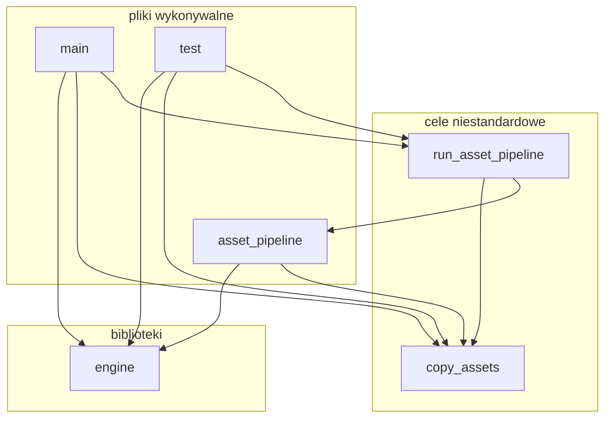

# Praca magisterska - draft

# Streszczenie
Ninejsza praca opisuje proces zaprojektowania i implementacja silnika renderującego używającego technik cieniowania odroczonego.
Silnik renderujący został zaimplementowany jako biblioteka języka C używająca ekosystemu Vulkan 1.2.
Opisano użyte techniki graficzne używanych podczas renderowania scen w nowoczesnych grach 3D.
Opisano architekturę silnika i szczegóły implementacyjne.
Wyrenderowano przykładową scenę i zbadano wydajność silnika.

# 1. Wprowadzenie
...

## Postawowe definicje
Zrozumienie celu pracy wymaga przybliżenia serii fundamentalnych pojęć związanych z grafiką komputerową.

Silnik graficzny ...

...

## Struktura pracy
Praca została podzielona na pięć rozdziałów.
Pierwszy rozdział pracy zawiera opis struktury pracy, cel i zakres pracy, podstawowe definicje oraz przegląd literatury i dostępnych rozwiązań związanych w tematyką silników renderujących.
W drugim rozdziale opisano architekturę silnika i szczegóły implementacji poszczególnych modułów silnika renderującego.
W trzecim rozdziale opisano specyficzny potok graficzny używający cieniowania odroczonego do realizacji modelu oświetlenia opartego o renderowanie bazujące na fizyce.
W czwartym rozdziale wyrenderowano przykładową scenę i zbadano wydajność silnika.
Ostatni rozdział zawiera podsumowanie oraz opis przewidywanych kierunków przyszłego rozwoju silnika. 

## Cel i zakres pracy
Celem pracy jest zaprojektowanie i zaimplementowanie silnika graficznego używajągo techniki cieniowania odroczonego.
Silnik został zaimplementowany jako biblioteka programistyczna przy użyciu języków C i Python oraz biblioteki graficznej Vulkan.
Celem autora było zapoznanie się z teorią stojącą za elementami składającymi się na silnik graficzny i praktyczne zademonstrowanie zdobytej wiedzy.

Praca ma formę przeglądową i jej zakres obejmuje:
- opis algorytmów i technik graficznych używanych w nowoczesnych silnikach graficznych,
- porównanie renderowania odroczonego z tradycyjnym renderowaniem wprzód,
- omówienie architektury i implementacji projektu,
- demonstrację użycia silnika graficznego do wyrenderowania przykładowej sceny,
- analizę wydajności silnika graficznego.

Omówiono obecny stan wiedzy dotyczący algorytmów, struktur i technik renderowania.
Szczególną uwagę przyłożono do technik cienowania odroczonego. 

Silnik graficzny składa się z [założenia kierujące projektem i implementacją]

...

## Przegląd 

# 2. Podstawy teoretyczne
...

# 3. Implementacja
Ten rozdział przedstawia szczegóły implementacji poszczególnych elementów silnika.

## Założenia

Implementacji przyświacały następujące:
Niskopoziomowość.
...

## Struktura plików

Wszystkie pliki silnika znajduje się w jednym katalogu głównym.

Katalog główny jest podzielony na mniejsze podkatalogi:
- *assets*: zawierający pliki wejściowe potoku zasobów,
- *src*: kod źródłowy silnika dla języka C,
- *scripts*: kod źródłowy silnika dla języka Python,
- *thirdparty*: kod źródłowy bibliotek zewnętrznych.

Proces budowania stwarza dodatkowe podkatalogi tymczasowe:
- *venv*: środowisko wirtualne interpretera języka Python,
- *cmake-build-debug* & *cmake-build-release*: katalogi budowania

## Użyte narzędzia

Silnik została napisany jako biblioteka w języku C w standardzie C11. Budowanie biblioteki ze źródeł wymaga generacji dodatkowego kodu przy pomocy skryptów w języku Python w wersji 3.9.7.

Silnik został opracowany na maszynie z systemem Linux i wspiera systemy Linux i Windows.
Projekt został w całości napisany przy użyciu środowiska programistycznego *CLion 2021.2.3*.

Podczas pracy stosowano rozproszony system kontroli wersji *git*. Repozytorium jest utrzymywane na serwisie *GitHub*.

Pliki *.clang-tidy* i *.clang-format* znajdujące się w strukturze plików projektu pozwalają na automatyczne formatowanie kodu źródłowego zgodnie ze uprzednio zdefiniowanym standardem kodowania.

Proces budowania projektu jest zautomatyzowany przy użyciu narzędzia CMake, które w przypadku języków C i C++ jest praktycznie standardem podczas rozwoju wieloplatformowych projektów.

### Proces budowania

Proces budowania silnika jest zdefiniowany w pliku *CMakeLists.txt* znajdującym się w katalogu głównym projektu.

Kompilacja kodu źródłowego w języku C jest obsługiwana bezpośrednio przez CMake, które generuje standardowe pliki kompilacji (pliki Makefile w systemie Unix, projekty Microsoft Visual C++ w systemie Windows). Użyto prekompilowanych nagłówków do przyśpieszenia kompilacji bibliotek zewnętrznych.

Skrypty w języku Python są obsługiwane pośrednio przez CMake, które wykrywa zainstalowany interpreter języka Python i używa go do stworzenia tzw. środowiska wirtualnego w tymczasowym katalogu venv/ w głównym katalogu projektu.
Podczas procesu budowania środowisko wirtualne jest używane do zainstalowania wymaganych zewnętrznych bibliotek w języku Python i wykonywania skryptów generatora kodu.
Zaletą użycia środowiska wirtualnego w porównaniu do bezpośredniego wywoływania zainstalowanego interpretera Pythona jest izolacja zarządzania zależnościami od reszty systemu operacyjnego, co pozwala na łatwiejszą powtarzalność podczas debugowania. [PEP]

CMake organizuje proces budowania jako graf, w którym wierzchołki to cele połączonych ze sobą zależnościami. Budowa celu wymaga wcześniejszego zbudowania wszystkich innych celów od których zależy budowany cel.

Wyróżniane są trzy rodzaje celów:
- plik wykonywalny
- biblioteka
- cel niestandardowy

Poniższy diagram przedstawia proces budowania projektu w formie celów i ich zależności: 

**engine** Cel odpowiedzialny za zbudowanie biblioteki programistycznej z implementacją silnika.

**main** Cel odpowiedzialny za zbudowanie pliku wykonywalnego o nazwie *main* demonstrującego użycie silnika poprzez wyrenderowanie przykładową scenę.

**test** Cel odpowiedzialny za zbudowanie pliku wykonywalnego o nazwie *test*  wykonującego testy integracyjne.

**asset_pipeline** Cel odpowiedzialny za zbudowanie pliku wykonywalnego o nazwie *asset_pipeline* będącego narzędziem wiersza poleceń implementującym operacje potoku zasobów.

**copy_assets** Niestandardowy cel odpowiedzialny za skopiowanie podkatalogu *assets* do katalogu budowania.

**run_asset_pipeline** Niestandardowy cel odpowiedzialny uruchomienie skryptu Python realizującego potok zasobów poprzez wielokrotne użycie wcześniej zbudowanego narzędzia *asset_pipeline*.

...

### Biblioteki zewnętrzne
Silnik następujących zewnętrznych bibliotek programistycznych:
- *Vulkan SDK 1.3.211.0*: pliki nagłówkowe dla Vulkan, kompilacja shaderów GLSL do kodu bajtowego SPIR-V poprzez *shaderc*, mechanizm refleksji dla kodu bajtowego SPIR-V poprzez SPIRV-Reflect,
- *glfw 3.4*: międzyplatformowa obsługa tworzenia okien, obsługa wejścia klawiatury i myszy,
- *sqlite 3.35.5*: relacyjna baza danych SQL,
- *uthash 2.3.0*: proste struktury danych (tablica dynamiczna, lista dwukierunkowa, tablica mieszająca),
- *xxHash 0.8.1*: niekryptograficzny algorytm mieszający,
- *cgltf 1.11*: wczytywanie plików w formacie glTF,
- *cglm 0.8.5*: biblioteka matematyczna,
- biblioteka standardowa C,
- API systemu: pliki nagłówkowe POSIX albo WinAPI,
- biblioteka standardowa Python,
- *libclang 12.0.0*: analizowanie kodu C w Python,

Dodatkowo biblioteka zbudowana w konfiguracji *Debug* statycznie linkuje biblioteki ASan (AddressSanitizer) i UBSan (UndefinedBehaviorSanitizer) wykrywające szeroką klasę błędów dotyczących niewłaściwego użycia pamięci i niezdefiniowanych zachowań. Błędy te w języku C są nieoczywiste i trudne do wykrycia przez programistę.
Podczas rozwoju projektu ASan wielokrotnie pozwolił na wykrycie i naprawienie następujących rodzajów błędów:
- wycieki pamięci,
- dereferencje zwisających wskaźników,
- dereferencja wskaźników NULL,
- dereferencja źle wyrównanych wskaźników,
- odczyt i zapis poza granicami tablicy.

## Architektura

Silnik składa się z siedmiu modułów. 
Moduły:
- generator kodu:  ...
- rdzeń: funkcje pomocnicze: ...
- zasoby: wczytywanie i zapisywanie danych sceny i konfiguracji globalnej
- scena: konstrukcja grafu sceny, drzewa sceny i listy renderującej
- potok graficzny: abstrakcja podstawowych operacji renderowane używających Vulkan
- przebieg renderowania: ...
- graf renderowania: ...

Każdemu modułowi zostanie poświęcony osobny podrozdział.

## Generator kodu
...

## Rdzeń
...

## Dane
[???]
...

## Zasoby

Moduł zasobów jest odpowiedzialny za zapisywanie i ładowanie sceny z bazy zasobów.
...

### Definicje

W kontekście silnika zasób można zdefiniować jako ogół jego elementów, które nie są częścią jego kodu źródłowego i mogą być niezależnie od niego dodawane, usuwane i modyfikowane.
Na potrzeby projektu wyróżniono następujące rodzaje zasobów:
- konfiguracja globalna
- ...

Wymienione powyżej rodzaje zasobów są opisane w następnych podrozdziałach.

*Konfiguracja globalna* Plik ...
...

## Scena
Moduł sceny jest odpowiedzialny za wygenerowanie ze sceny listy obiektów renderowania.
Struktury:
Scene data...
Scene graph...
Scene tree...
Render cache...
Render cache list...

...

## Potok graficzny
Moduł potoku graficznego udostępnia zbiór obiektów pozwalających na użycie bilioteki graficznej Vulkan za pośrednictwem wygodniejszej dla programisty abstrakcji.
...

## Przebieg renderowania
Moduł przebiegu renderowania jest odpowiedzialny za wyrenderowanie całości bądź części listy renderującej.
Przebieg renderowania nagrywa komendy do podanego bufora komend.
[DIAGRAM]

...

## Graf renderowania
Moduł grafu renderowania jest odpowiedzialny za stworzenie przebiegów renderowania na podstawie wysokopoziomowego deklaratywne opisu renderowania dostarczonego przez programistę.
...

# 4. Badania
...

# 5. Podsumowanie
...

# Bibliografia
...
[PEP] https://peps.python.org/pep-0405/

# TODO
...
