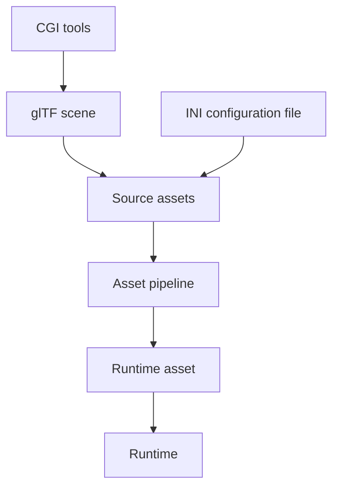
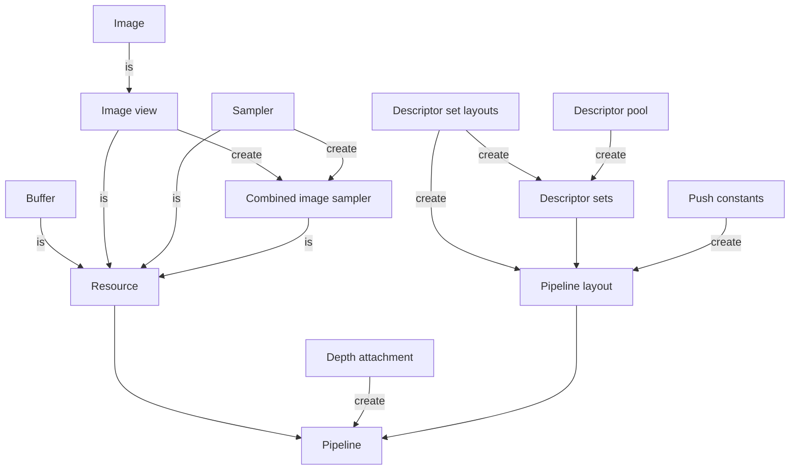

### World space and clip space

- Use left-handed world coordinates:
    - +X points right
    - +Y points up
    - +Z points forward (which is what makes it left-handed)
    - [Left- vs. Right-handed coordinate systems](https://www.evl.uic.edu/ralph/508S98/coordinates.html)
- Use clip space with reversed-Z:
    - The origin is at the top left.
    - +X points right
    - +X points left
    - -Z points forward (reversed-Z)
    - [Perspective Projections](https://learnwebgl.brown37.net/08_projections/projections_perspective.html)
    - [The Indulgence of Engine Porting](http://whirlicube.com/the-indulgence-of-engine-porting.html)
- Front faces are counterclockwise.

### Config

- Global engine config examples:
    - window width and height
    - window title
- Global engine config in stored in the INI configuration file in _assets/config.ini_.
- Supports multiple config sections:
    - \[graphics\]
        - windowWidth
        - windowHeight
        - windowTitle
    - \[controls\]
        - enabled

### Asset pipeline

- Source assets:
    - glTF scenes
    - TODO: textures

- Runtime assets:
    - _config.ini_
        - INI configuration file
    - _data.db_
        - SQLite asset database.
        - Table "mesh"
            - key TEXT
                - TODO: hash
            - topology INT
            - indices BLOB
                - only 32-bit indices
            - vertices BLOB
        - TODO: textures
        - TODO: scenes

### Debugging functionality

- Debug messengers using VK_EXT_debug_utils:
    - Active only in Debug builds.
    - Short-lived debug messenger for instance creation and destruction:
        - Produces validation layer errors.
    - Persistent debug messenger:
        - Produces validation layer errors.
        - Named objects:
            - Used by validation layers, RenderDoc and other debugging tools.
            - Example: function _create_buffer()_ takes argument _debugName = "geometry buffer"_, which results in two
              new named objects:
                - device memory "geometry buffer - device memory (...)"
                - device memory "geometry buffer - buffer (...)"
        - TODO: Command buffer labels.
        - Doesn't use tags - objects have names, which allow for additional data tracking in vulkan_debug_data.
            - "In general, most debug layers and tools get the necessary information they need by simply referring to
              objects by name. Since the Debug Utils Messenger callbacks return to the application, no binary data is
              needed to pass through the layers except a name to keep track of unique objects. The application is
              already the keeper of all the information it needs, so no tagging information is returned through the
              Debug Utils Messenger callback"
              https://www.lunarg.com/wp-content/uploads/2018/05/Vulkan-Debug-Utils_05_18_v1.pdf

### Terminology

**Resource**:

- two primary types: buffer or image (accessed using image view, combined with sampler).
- just a block of bytes in host or device memory

**Descriptor**:

- opaque handle used by shader to access **resource**,
- one shader **binding** that tells shader:
    - where is the resource,
    - what is the type of resource
    - how it will be accessed,
- updated using **vkUpdateDescriptorSets()**,
- descriptor is not bound individually, but in array in **descriptor set**

**Descriptor set**:

- array of descriptors of same type
- created using one **descriptor set layout**
- basic optimization: group descriptors into descriptor sets nu update frequency:
    - 1 set for camera/environment uniform buffers
    - 1 set for materials/textures samplers
    - 1 set for object transform uniform buffers
    - ...

**Descriptor set layout**:

- describes one **descriptor set**:
    - type of single descriptor
    - number of descriptors in descriptor set
    - binding number used in shader
    - pipeline shader stages that can access descriptor set
- used to create descriptor set
- used to create pipeline layout

Pipeline layout:

- allows pipeline to access to descriptor sets and push constants.
- requires descriptor set layout and push constant ranges.

TODO: Describe render pass.

See also:

- https://developer.nvidia.com/vulkan-shader-resource-binding
 