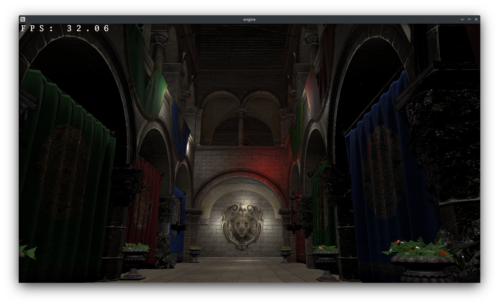
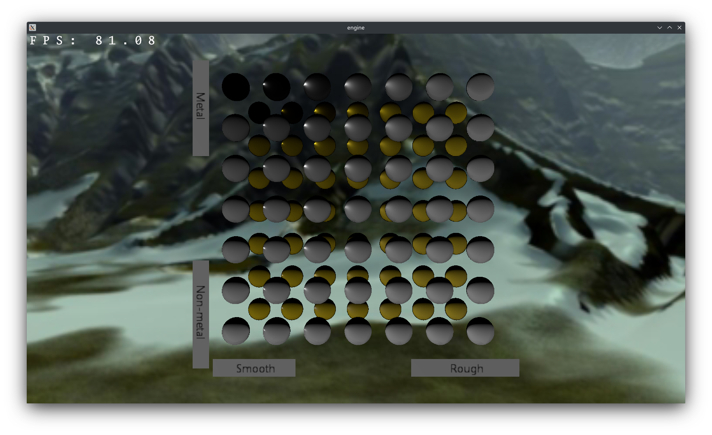
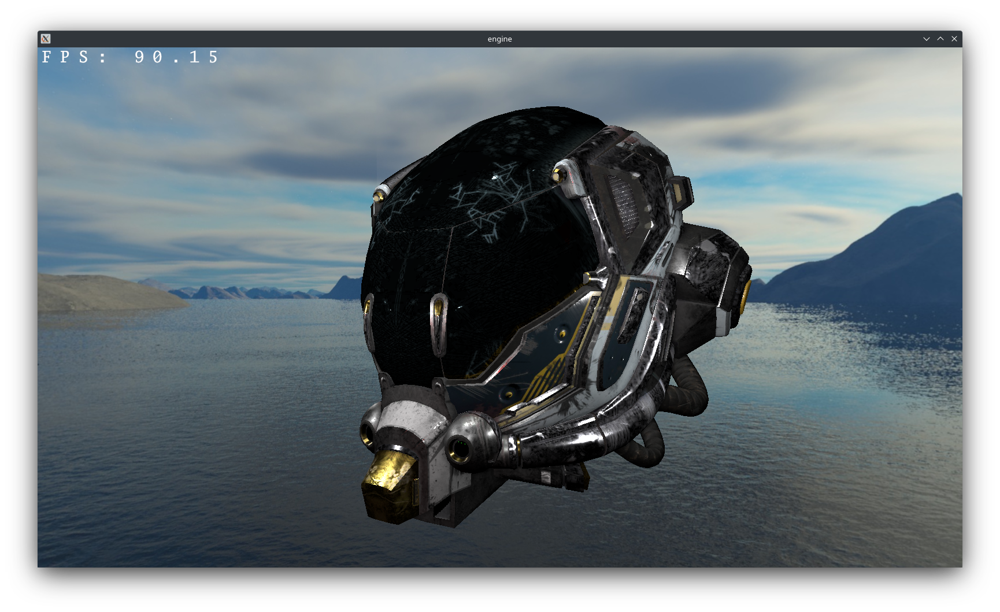

# Abstract

Rendering engine implemented using C and Vulkan 1.2.

Showcases the low and high-level techniques such as:
- deferred rendering: render graph, VK_KHR_dynamic_rendering, PBR;
- bindless rendering: VK_EXT_descriptor_indexing;
- indirect rendering: vkCmdDrawIndexedIndirect, multiDrawIndirect;
- debug printf in GLSL shaders;
- asset pipeline;
- scene graph: glTF models, draw call optimization.

# How to build
1. `git submodule update --force --recursive --init --remote`
2. Request, download and copy input assets to `assets/`
3. `cmake . & make`

# Sample scenes

